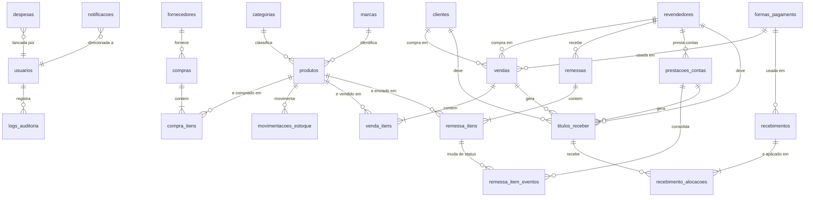
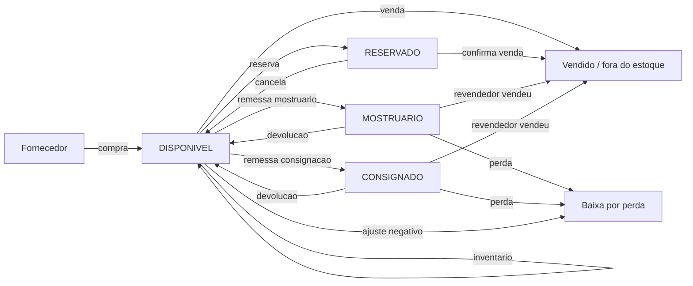

# SISTEMA DE GESTÃO DE FRAGRÂNCIAS
## Documento 2 — Modelagem Completa do Banco de Dados

**Versão:** 1.0
**SGBD:** PostgreSQL 15+ (Supabase)
**Referência:** este documento implementa as decisões ADR-01 a ADR-07 do Documento 1.

---

## SUMÁRIO

1. [Princípios de modelagem](#1-princípios-de-modelagem)
2. [Convenções e tipos de dados](#2-convenções-e-tipos-de-dados)
3. [Mapa de tabelas](#3-mapa-de-tabelas)
4. [Diagrama Entidade-Relacionamento](#4-diagrama-entidade-relacionamento)
5. [Matriz de relacionamentos](#5-matriz-de-relacionamentos)
6. [DDL — Bloco 1: Extensões e tipos](#6-ddl--bloco-1-extensões-e-tipos)
7. [DDL — Bloco 2: Segurança e usuários](#7-ddl--bloco-2-segurança-e-usuários)
8. [DDL — Bloco 3: Cadastros base](#8-ddl--bloco-3-cadastros-base)
9. [DDL — Bloco 4: Produtos](#9-ddl--bloco-4-produtos)
10. [DDL — Bloco 5: Compras](#10-ddl--bloco-5-compras)
11. [DDL — Bloco 6: Estoque](#11-ddl--bloco-6-estoque)
12. [DDL — Bloco 7: Vendas](#12-ddl--bloco-7-vendas)
13. [DDL — Bloco 8: Consignação e mostruários](#13-ddl--bloco-8-consignação-e-mostruários)
14. [DDL — Bloco 9: Financeiro](#14-ddl--bloco-9-financeiro)
15. [DDL — Bloco 10: Auditoria, parâmetros e alertas](#15-ddl--bloco-10-auditoria-parâmetros-e-alertas)
16. [DDL — Bloco 11: Funções de cálculo](#16-ddl--bloco-11-funções-de-cálculo)
17. [DDL — Bloco 12: Triggers de integridade](#17-ddl--bloco-12-triggers-de-integridade)
18. [DDL — Bloco 13: Views de negócio](#18-ddl--bloco-13-views-de-negócio)
19. [DDL — Bloco 14: Índices complementares](#19-ddl--bloco-14-índices-complementares)
20. [DDL — Bloco 15: RLS](#20-ddl--bloco-15-rls)
21. [DDL — Bloco 16: Seed inicial](#21-ddl--bloco-16-seed-inicial)
22. [Regras de integridade consolidadas](#22-regras-de-integridade-consolidadas)
23. [Estratégia de backup](#23-estratégia-de-backup)

---

## 1. PRINCÍPIOS DE MODELAGEM

| # | Princípio | Aplicação |
|---|---|---|
| 1 | **Normalização até 3FN** | Nenhum dado é armazenado em dois lugares, exceto caches explicitamente declarados e mantidos por trigger |
| 2 | **Caches declarados** | `produtos.custo_medio`, `produtos.qtd_*`, `titulos_receber.valor_recebido` são caches. São sempre recalculáveis a partir dos fatos e são mantidos exclusivamente por trigger |
| 3 | **Fatos imutáveis** | `movimentacoes_estoque`, `recebimento_alocacoes` e `remessa_item_eventos` nunca sofrem UPDATE/DELETE. Correção = lançamento de estorno |
| 4 | **Valores históricos congelados** | Custo e preço praticados são gravados na linha do documento. Mudar o preço de um produto hoje não altera o lucro de uma venda de ontem |
| 5 | **Situação derivada** | Situação de título, situação de produto e status de estoque são calculados, nunca digitados |
| 6 | **Integridade no banco** | Toda regra crítica tem `CHECK`, `FK` ou `TRIGGER`. O banco é a última linha de defesa |
| 7 | **Soft delete em cadastro, cancelamento em documento** | `deleted_at` para cadastros; `status = CANCELADO` para documentos |
| 8 | **Auditoria universal** | Toda tabela de negócio tem `created_at`, `updated_at`, `created_by`, `updated_by` e trigger de log |

---

## 2. CONVENÇÕES E TIPOS DE DADOS

### 2.1 Tipos padronizados

| Conceito | Tipo | Justificativa |
|---|---|---|
| Chave primária | `UUID` (`gen_random_uuid()`) | Não expõe volume de negócio, permite geração no cliente, seguro para sincronização futura |
| Numeração de documento | `BIGINT` via `SEQUENCE` | Sequencial visível ao usuário (Compra nº 1, Venda nº 1) — exigência de RN-V10 |
| **Valor monetário (total)** | `NUMERIC(14,2)` | **Nunca `float`/`real`/`double`** — erro de arredondamento binário é inaceitável em dinheiro |
| **Custo unitário / custo médio** | `NUMERIC(14,4)` | 4 casas evitam acúmulo de erro no custo médio ponderado; exibido com 2 casas |
| Preço de venda | `NUMERIC(14,2)` | É o valor efetivamente cobrado |
| Percentual | `NUMERIC(7,4)` | Ex.: 33,3333% |
| Quantidade | `NUMERIC(14,3)` | Permite fração (decants em ml) sem quebrar unidades inteiras |
| Data de negócio | `DATE` | Vencimento, data da venda — **sem hora**, evita deslocamento por fuso (R10) |
| Carimbo de tempo | `TIMESTAMPTZ` | `created_at`, `updated_at` — sempre com fuso |
| Texto curto | `TEXT` + `CHECK (length(...))` | Postgres não ganha performance com `VARCHAR(n)`; o `CHECK` documenta o limite |
| Situação / tipo | `ENUM` nativo | Impede valor inválido no banco, é autodocumentado e ocupa 4 bytes |
| Dados semiestruturados | `JSONB` | Apenas em `logs_auditoria` |

### 2.2 Colunas de controle presentes em toda tabela de negócio

```sql
id           UUID PRIMARY KEY DEFAULT gen_random_uuid()
created_at   TIMESTAMPTZ NOT NULL DEFAULT now()
updated_at   TIMESTAMPTZ NOT NULL DEFAULT now()
created_by   UUID REFERENCES public.usuarios(id)
updated_by   UUID REFERENCES public.usuarios(id)
deleted_at   TIMESTAMPTZ            -- apenas em tabelas de cadastro
```

---

## 3. MAPA DE TABELAS

**25 tabelas**, agrupadas por domínio.

| Grupo | Tabela | Finalidade | Tipo |
|---|---|---|---|
| **Segurança** | `usuarios` | Perfil de aplicação vinculado ao `auth.users` | Cadastro |
| | `permissoes` | Matriz recurso × ação × perfil | Configuração |
| **Cadastros** | `categorias` | Categoria do produto | Cadastro |
| | `marcas` | Marca/fabricante | Cadastro |
| | `fornecedores` | Fornecedores de compra | Cadastro |
| | `clientes` | Consumidores finais | Cadastro |
| | `revendedores` | Revendedores | Cadastro |
| | `formas_pagamento` | Formas de pagamento aceitas | Configuração |
| **Produtos** | `produtos` | Catálogo + saldos + custo médio | Cadastro |
| **Compras** | `compras` | Cabeçalho da compra | Documento |
| | `compra_itens` | Itens com custo rateado | Documento |
| **Estoque** | `movimentacoes_estoque` | Livro-razão imutável (ADR-01) | Fato |
| **Vendas** | `vendas` | Cabeçalho da venda | Documento |
| | `venda_itens` | Itens com CMV congelado | Documento |
| **Consignação** | `remessas` | Envio a revendedor (mostruário/consignação) | Documento |
| | `remessa_itens` | Itens com saldo por situação | Documento |
| | `remessa_item_eventos` | Cada transição de status (fato imutável) | Fato |
| | `prestacoes_contas` | Acerto periódico com o revendedor | Documento |
| **Financeiro** | `titulos_receber` | Uma linha por parcela devida | Documento |
| | `recebimentos` | Entrada de dinheiro (evento de caixa) | Fato |
| | `recebimento_alocacoes` | Aplicação do dinheiro nos títulos | Fato |
| | `despesas` | Despesas e perdas | Documento |
| **Sistema** | `logs_auditoria` | Trilha de auditoria | Fato |
| | `parametros` | Configurações do sistema | Configuração |
| | `notificacoes` | Alertas gerados pelo sistema | Fato |

### 3.1 Onde cada entidade pedida no Prompt 2 foi implementada

| Entidade pedida | Tabela(s) |
|---|---|
| Produtos | `produtos` |
| Compras | `compras` |
| Itens da Compra | `compra_itens` |
| Clientes | `clientes` |
| Revendedores | `revendedores` |
| Vendas | `vendas` |
| Itens da Venda | `venda_itens` |
| Parcelas | `titulos_receber` (uma linha por parcela) |
| Recebimentos | `recebimentos` + `recebimento_alocacoes` (ADR-04) |
| Contas a Receber | `titulos_receber` (a situação é derivada em `vw_titulos_receber`) |
| Estoque | `produtos` (saldos) + `movimentacoes_estoque` (histórico) — ADR-01 |
| Movimentação de Estoque | `movimentacoes_estoque` |
| Mostruários | `remessas` + `remessa_itens` + `remessa_item_eventos` |
| Prestação de Contas | `prestacoes_contas` |
| Usuários | `usuarios` |
| Permissões | `permissoes` |
| Logs | `logs_auditoria` |

As demais tabelas (`categorias`, `marcas`, `fornecedores`, `formas_pagamento`, `despesas`, `parametros`, `notificacoes`) são de apoio, exigidas pelos módulos dos Prompts 4, 13 e 14.

---

## 4. DIAGRAMA ENTIDADE-RELACIONAMENTO



### 4.1 Diagrama dos fluxos de estoque



---

## 5. MATRIZ DE RELACIONAMENTOS

| Tabela filha | Coluna FK | Tabela pai | Cardinalidade | ON DELETE | Obrigatória |
|---|---|---|---|---|:---:|
| `produtos` | `categoria_id` | `categorias` | N:1 | RESTRICT | Não |
| `produtos` | `marca_id` | `marcas` | N:1 | RESTRICT | Não |
| `compras` | `fornecedor_id` | `fornecedores` | N:1 | RESTRICT | **Sim** |
| `compra_itens` | `compra_id` | `compras` | N:1 | CASCADE | **Sim** |
| `compra_itens` | `produto_id` | `produtos` | N:1 | RESTRICT | **Sim** |
| `movimentacoes_estoque` | `produto_id` | `produtos` | N:1 | RESTRICT | **Sim** |
| `movimentacoes_estoque` | `estorno_de_id` | `movimentacoes_estoque` | N:1 | RESTRICT | Não |
| `vendas` | `cliente_id` | `clientes` | N:1 | RESTRICT | Condicional¹ᵃ |
| `vendas` | `revendedor_id` | `revendedores` | N:1 | RESTRICT | Condicional¹ |
| `vendas` | `forma_pagamento_id` | `formas_pagamento` | N:1 | RESTRICT | **Sim** |
| `venda_itens` | `venda_id` | `vendas` | N:1 | CASCADE | **Sim** |
| `venda_itens` | `produto_id` | `produtos` | N:1 | RESTRICT | **Sim** |
| `remessas` | `revendedor_id` | `revendedores` | N:1 | RESTRICT | **Sim** |
| `remessa_itens` | `remessa_id` | `remessas` | N:1 | CASCADE | **Sim** |
| `remessa_itens` | `produto_id` | `produtos` | N:1 | RESTRICT | **Sim** |
| `remessa_item_eventos` | `remessa_item_id` | `remessa_itens` | N:1 | CASCADE | **Sim** |
| `remessa_item_eventos` | `prestacao_id` | `prestacoes_contas` | N:1 | RESTRICT | Não |
| `prestacoes_contas` | `revendedor_id` | `revendedores` | N:1 | RESTRICT | **Sim** |
| `titulos_receber` | `venda_id` | `vendas` | N:1 | RESTRICT | Condicional² |
| `titulos_receber` | `prestacao_id` | `prestacoes_contas` | N:1 | RESTRICT | Condicional² |
| `titulos_receber` | `cliente_id` | `clientes` | N:1 | RESTRICT | Condicional¹ |
| `titulos_receber` | `revendedor_id` | `revendedores` | N:1 | RESTRICT | Condicional¹ |
| `recebimento_alocacoes` | `recebimento_id` | `recebimentos` | N:1 | CASCADE | **Sim** |
| `recebimento_alocacoes` | `titulo_id` | `titulos_receber` | N:1 | RESTRICT | **Sim** |
| `recebimentos` | `forma_pagamento_id` | `formas_pagamento` | N:1 | RESTRICT | **Sim** |
| `despesas` | `produto_id` | `produtos` | N:1 | SET NULL | Não |
| `logs_auditoria` | `usuario_id` | `usuarios` | N:1 | SET NULL | Não |

¹ Em `titulos_receber`: **exatamente um** entre `cliente_id` e `revendedor_id` (`chk_titulo_devedor`).
¹ᵃ Em `vendas`: **no máximo um**. Venda a consumidor não identificado (balcão, à vista) tem os dois nulos — permitido por `chk_vendas_destinatario` e descrito em I-13.
² **No máximo um** entre `venda_id` e `prestacao_id` — garantido por `CHECK`.

---

## 6. DDL — BLOCO 1: EXTENSÕES E TIPOS

```sql
-- =====================================================================
-- 0001_extensions_e_enums.sql
-- =====================================================================

CREATE EXTENSION IF NOT EXISTS "pgcrypto";      -- gen_random_uuid()
CREATE EXTENSION IF NOT EXISTS "unaccent";      -- busca sem acento
CREATE EXTENSION IF NOT EXISTS "pg_trgm";       -- busca por similaridade
CREATE EXTENSION IF NOT EXISTS "btree_gist";    -- índices compostos

-- ---------------------------------------------------------------------
-- NORMALIZAÇÃO DE TEXTO PARA ÍNDICE
--
-- ATENÇÃO: unaccent(text) é STABLE, não IMMUTABLE (depende do dicionário
-- carregado). Usá-la diretamente em CREATE INDEX falha com
-- "functions in index expression must be marked IMMUTABLE".
-- A forma correta é fixar o dicionário via regdictionary e declarar a
-- função como IMMUTABLE. No Supabase as extensões ficam no schema
-- "extensions", que precisa ser qualificado explicitamente.
-- ---------------------------------------------------------------------
CREATE OR REPLACE FUNCTION public.fn_norm(p_texto TEXT)
RETURNS TEXT LANGUAGE sql IMMUTABLE PARALLEL SAFE STRICT AS $$
    SELECT lower(extensions.unaccent('extensions.unaccent'::regdictionary, p_texto));
$$;
COMMENT ON FUNCTION public.fn_norm IS
  'Minúsculas sem acento. IMMUTABLE — única forma segura de indexar texto normalizado.';

-- ---------------------------------------------------------------------
-- TIPOS ENUMERADOS
-- ---------------------------------------------------------------------

-- Perfis de acesso
CREATE TYPE perfil_usuario_enum AS ENUM
    ('ADMIN', 'GERENTE', 'VENDEDOR', 'FINANCEIRO');

-- Situação genérica de documento
CREATE TYPE status_documento_enum AS ENUM
    ('RASCUNHO', 'CONFIRMADO', 'CANCELADO');

-- Bolsos de estoque (ADR-01)
CREATE TYPE bucket_estoque_enum AS ENUM
    ('DISPONIVEL', 'RESERVADO', 'MOSTRUARIO', 'CONSIGNADO');

-- Natureza da movimentação de estoque
CREATE TYPE tipo_movimento_enum AS ENUM
    ('ENTRADA_COMPRA',
     'SAIDA_VENDA',
     'SAIDA_REMESSA',
     'RETORNO_DEVOLUCAO',
     'BAIXA_VENDA_CONSIGNADA',
     'BAIXA_PERDA',
     'RESERVA',
     'LIBERACAO_RESERVA',
     'AJUSTE_POSITIVO',
     'AJUSTE_NEGATIVO',
     'ESTORNO');

-- Canal da venda
CREATE TYPE tipo_venda_enum AS ENUM
    ('CONSUMIDOR', 'REVENDEDOR');

-- Natureza da remessa
CREATE TYPE tipo_remessa_enum AS ENUM
    ('MOSTRUARIO', 'CONSIGNACAO');

-- Situação de uma unidade enviada a revendedor (ADR-05)
CREATE TYPE status_item_remessa_enum AS ENUM
    ('EM_POSSE', 'VENDIDO', 'DEVOLVIDO', 'PERDIDO', 'TROCADO');

-- Situação base do título (o VENCIDO/A_VENCER é derivado em view — RN-F01)
CREATE TYPE situacao_titulo_enum AS ENUM
    ('ABERTO', 'PAGO', 'CANCELADO');

-- Quem deve
CREATE TYPE tipo_devedor_enum AS ENUM
    ('CLIENTE', 'REVENDEDOR');

-- Origem do título
CREATE TYPE origem_titulo_enum AS ENUM
    ('VENDA', 'PRESTACAO_CONTAS', 'AVULSO');

-- Critério de rateio dos custos acessórios (ADR-03)
CREATE TYPE criterio_rateio_enum AS ENUM
    ('VALOR', 'QUANTIDADE');

-- Categoria de despesa
CREATE TYPE categoria_despesa_enum AS ENUM
    ('PERDA_ESTOQUE',
     'FRETE_ENVIO',
     'TAXA_PAGAMENTO',
     'EMBALAGEM',
     'MARKETING',
     'COMISSAO',
     'OPERACIONAL',
     'OUTRAS');

-- Natureza da despesa (base do ponto de equilíbrio)
CREATE TYPE natureza_despesa_enum AS ENUM
    ('FIXA', 'VARIAVEL');

-- Ação auditada
CREATE TYPE acao_auditoria_enum AS ENUM
    ('INSERT', 'UPDATE', 'DELETE', 'CANCEL', 'LOGIN', 'LOGOUT', 'EXPORT');

-- Severidade de alerta
CREATE TYPE severidade_enum AS ENUM
    ('INFO', 'ATENCAO', 'CRITICO');

-- Tipo de notificação
CREATE TYPE tipo_notificacao_enum AS ENUM
    ('PARCELA_A_VENCER',
     'PARCELA_VENCIDA',
     'MOSTRUARIO_ANTIGO',
     'PRODUTO_PARADO',
     'ESTOQUE_BAIXO',
     'SISTEMA');
```

---

## 7. DDL — BLOCO 2: SEGURANÇA E USUÁRIOS

```sql
-- =====================================================================
-- 0002_seguranca.sql
-- =====================================================================

CREATE TABLE public.usuarios (
    id            UUID PRIMARY KEY
                  REFERENCES auth.users(id) ON DELETE CASCADE,
    nome          TEXT NOT NULL CHECK (length(trim(nome)) BETWEEN 2 AND 120),
    email         TEXT NOT NULL,
    perfil        perfil_usuario_enum NOT NULL DEFAULT 'ADMIN',
    telefone      TEXT,
    ativo         BOOLEAN NOT NULL DEFAULT true,
    ultimo_acesso TIMESTAMPTZ,
    created_at    TIMESTAMPTZ NOT NULL DEFAULT now(),
    updated_at    TIMESTAMPTZ NOT NULL DEFAULT now(),
    CONSTRAINT uq_usuarios_email UNIQUE (email)
);
COMMENT ON TABLE public.usuarios IS
  'Perfil de aplicação. A autenticação em si vive em auth.users (Supabase Auth).';

CREATE INDEX idx_usuarios_perfil ON public.usuarios (perfil) WHERE ativo;


CREATE TABLE public.permissoes (
    id       UUID PRIMARY KEY DEFAULT gen_random_uuid(),
    perfil   perfil_usuario_enum NOT NULL,
    recurso  TEXT NOT NULL,     -- 'compras', 'vendas', 'financeiro'...
    acao     TEXT NOT NULL      -- 'ler', 'criar', 'editar', 'excluir', 'cancelar', 'estornar'
             CHECK (acao IN ('ler','criar','editar','excluir','cancelar','estornar','exportar')),
    permitido BOOLEAN NOT NULL DEFAULT false,
    CONSTRAINT uq_permissoes UNIQUE (perfil, recurso, acao)
);

CREATE INDEX idx_permissoes_perfil ON public.permissoes (perfil, recurso);
```

---

## 8. DDL — BLOCO 3: CADASTROS BASE

```sql
-- =====================================================================
-- 0003_cadastros.sql
-- =====================================================================

-- ---------------------------------------------------------------------
-- CATEGORIAS
-- ---------------------------------------------------------------------
CREATE TABLE public.categorias (
    id         UUID PRIMARY KEY DEFAULT gen_random_uuid(),
    nome       TEXT NOT NULL CHECK (length(trim(nome)) BETWEEN 2 AND 80),
    descricao  TEXT,
    ativo      BOOLEAN NOT NULL DEFAULT true,
    created_at TIMESTAMPTZ NOT NULL DEFAULT now(),
    updated_at TIMESTAMPTZ NOT NULL DEFAULT now(),
    created_by UUID REFERENCES public.usuarios(id),
    updated_by UUID REFERENCES public.usuarios(id),
    deleted_at TIMESTAMPTZ
);
CREATE UNIQUE INDEX uq_categorias_nome
    ON public.categorias (public.fn_norm(nome)) WHERE deleted_at IS NULL;


-- ---------------------------------------------------------------------
-- MARCAS
-- ---------------------------------------------------------------------
CREATE TABLE public.marcas (
    id         UUID PRIMARY KEY DEFAULT gen_random_uuid(),
    nome       TEXT NOT NULL CHECK (length(trim(nome)) BETWEEN 2 AND 80),
    ativo      BOOLEAN NOT NULL DEFAULT true,
    created_at TIMESTAMPTZ NOT NULL DEFAULT now(),
    updated_at TIMESTAMPTZ NOT NULL DEFAULT now(),
    created_by UUID REFERENCES public.usuarios(id),
    updated_by UUID REFERENCES public.usuarios(id),
    deleted_at TIMESTAMPTZ
);
CREATE UNIQUE INDEX uq_marcas_nome
    ON public.marcas (public.fn_norm(nome)) WHERE deleted_at IS NULL;


-- ---------------------------------------------------------------------
-- FORNECEDORES
-- ---------------------------------------------------------------------
CREATE TABLE public.fornecedores (
    id           UUID PRIMARY KEY DEFAULT gen_random_uuid(),
    nome         TEXT NOT NULL CHECK (length(trim(nome)) BETWEEN 2 AND 150),
    documento    TEXT,                       -- CPF ou CNPJ (somente dígitos)
    telefone     TEXT,
    whatsapp     TEXT,
    email        TEXT CHECK (email IS NULL OR email ~* '^[^@\s]+@[^@\s]+\.[^@\s]+$'),
    cidade       TEXT,
    estado       CHAR(2) CHECK (estado IS NULL OR estado ~ '^[A-Z]{2}$'),
    endereco     TEXT,
    observacoes  TEXT,
    ativo        BOOLEAN NOT NULL DEFAULT true,
    created_at   TIMESTAMPTZ NOT NULL DEFAULT now(),
    updated_at   TIMESTAMPTZ NOT NULL DEFAULT now(),
    created_by   UUID REFERENCES public.usuarios(id),
    updated_by   UUID REFERENCES public.usuarios(id),
    deleted_at   TIMESTAMPTZ
);
CREATE UNIQUE INDEX uq_fornecedores_documento
    ON public.fornecedores (documento)
    WHERE documento IS NOT NULL AND deleted_at IS NULL;
CREATE INDEX idx_fornecedores_nome_trgm
    ON public.fornecedores USING gin (public.fn_norm(nome) gin_trgm_ops);


-- ---------------------------------------------------------------------
-- CLIENTES  (Prompt 7)
-- ---------------------------------------------------------------------
CREATE TABLE public.clientes (
    id            UUID PRIMARY KEY DEFAULT gen_random_uuid(),
    codigo        BIGINT GENERATED BY DEFAULT AS IDENTITY,
    nome          TEXT NOT NULL CHECK (length(trim(nome)) BETWEEN 2 AND 150),
    cpf           TEXT CHECK (cpf IS NULL OR cpf ~ '^[0-9]{11}$'),
    telefone      TEXT CHECK (telefone IS NULL OR telefone ~ '^[0-9]{10,11}$'),
    whatsapp      TEXT CHECK (whatsapp IS NULL OR whatsapp ~ '^[0-9]{10,11}$'),
    email         TEXT CHECK (email IS NULL OR email ~* '^[^@\s]+@[^@\s]+\.[^@\s]+$'),
    data_nascimento DATE CHECK (data_nascimento IS NULL OR data_nascimento < CURRENT_DATE),
    cep           TEXT CHECK (cep IS NULL OR cep ~ '^[0-9]{8}$'),
    endereco      TEXT,
    numero        TEXT,
    complemento   TEXT,
    bairro        TEXT,
    cidade        TEXT,
    estado        CHAR(2) CHECK (estado IS NULL OR estado ~ '^[A-Z]{2}$'),
    observacoes   TEXT,
    ativo         BOOLEAN NOT NULL DEFAULT true,
    created_at    TIMESTAMPTZ NOT NULL DEFAULT now(),
    updated_at    TIMESTAMPTZ NOT NULL DEFAULT now(),
    created_by    UUID REFERENCES public.usuarios(id),
    updated_by    UUID REFERENCES public.usuarios(id),
    deleted_at    TIMESTAMPTZ
);
-- CPF único entre clientes ativos (R7)
CREATE UNIQUE INDEX uq_clientes_cpf
    ON public.clientes (cpf) WHERE cpf IS NOT NULL AND deleted_at IS NULL;
CREATE UNIQUE INDEX uq_clientes_codigo ON public.clientes (codigo);
CREATE INDEX idx_clientes_nome_trgm
    ON public.clientes USING gin (public.fn_norm(nome) gin_trgm_ops);
CREATE INDEX idx_clientes_cidade ON public.clientes (cidade) WHERE deleted_at IS NULL;


-- ---------------------------------------------------------------------
-- REVENDEDORES  (Prompt 8)
-- ---------------------------------------------------------------------
CREATE TABLE public.revendedores (
    id                UUID PRIMARY KEY DEFAULT gen_random_uuid(),
    codigo            BIGINT GENERATED BY DEFAULT AS IDENTITY,
    nome              TEXT NOT NULL CHECK (length(trim(nome)) BETWEEN 2 AND 150),
    cpf               TEXT CHECK (cpf IS NULL OR cpf ~ '^[0-9]{11}$'),
    telefone          TEXT CHECK (telefone IS NULL OR telefone ~ '^[0-9]{10,11}$'),
    whatsapp          TEXT CHECK (whatsapp IS NULL OR whatsapp ~ '^[0-9]{10,11}$'),
    email             TEXT CHECK (email IS NULL OR email ~* '^[^@\s]+@[^@\s]+\.[^@\s]+$'),
    cep               TEXT CHECK (cep IS NULL OR cep ~ '^[0-9]{8}$'),
    endereco          TEXT,
    numero            TEXT,
    complemento       TEXT,
    bairro            TEXT,
    cidade            TEXT,
    estado            CHAR(2) CHECK (estado IS NULL OR estado ~ '^[A-Z]{2}$'),
    data_cadastro     DATE NOT NULL DEFAULT CURRENT_DATE,
    limite_credito    NUMERIC(14,2) NOT NULL DEFAULT 0
                      CHECK (limite_credito >= 0),
    prazo_acerto_dias INTEGER NOT NULL DEFAULT 30
                      CHECK (prazo_acerto_dias BETWEEN 1 AND 365),
    observacoes       TEXT,
    ativo             BOOLEAN NOT NULL DEFAULT true,
    created_at        TIMESTAMPTZ NOT NULL DEFAULT now(),
    updated_at        TIMESTAMPTZ NOT NULL DEFAULT now(),
    created_by        UUID REFERENCES public.usuarios(id),
    updated_by        UUID REFERENCES public.usuarios(id),
    deleted_at        TIMESTAMPTZ
);
CREATE UNIQUE INDEX uq_revendedores_cpf
    ON public.revendedores (cpf) WHERE cpf IS NOT NULL AND deleted_at IS NULL;
CREATE UNIQUE INDEX uq_revendedores_codigo ON public.revendedores (codigo);
CREATE INDEX idx_revendedores_nome_trgm
    ON public.revendedores USING gin (public.fn_norm(nome) gin_trgm_ops);
CREATE INDEX idx_revendedores_cidade_uf
    ON public.revendedores (estado, cidade) WHERE deleted_at IS NULL;


-- ---------------------------------------------------------------------
-- FORMAS DE PAGAMENTO
-- ---------------------------------------------------------------------
CREATE TABLE public.formas_pagamento (
    id                UUID PRIMARY KEY DEFAULT gen_random_uuid(),
    nome              TEXT NOT NULL,
    permite_parcelar  BOOLEAN NOT NULL DEFAULT false,
    max_parcelas      SMALLINT NOT NULL DEFAULT 1
                      CHECK (max_parcelas BETWEEN 1 AND 4),   -- RN-V04
    taxa_percentual   NUMERIC(7,4) NOT NULL DEFAULT 0
                      CHECK (taxa_percentual >= 0 AND taxa_percentual <= 100),
    prazo_compensacao_dias SMALLINT NOT NULL DEFAULT 0
                      CHECK (prazo_compensacao_dias >= 0),
    ativo             BOOLEAN NOT NULL DEFAULT true,
    created_at        TIMESTAMPTZ NOT NULL DEFAULT now(),
    CONSTRAINT uq_formas_pagamento_nome UNIQUE (nome),
    CONSTRAINT chk_forma_parcelamento
        CHECK ((permite_parcelar AND max_parcelas > 1)
               OR (NOT permite_parcelar AND max_parcelas = 1))
);
```

---

## 9. DDL — BLOCO 4: PRODUTOS

```sql
-- =====================================================================
-- 0004_produtos.sql   (Prompt 5)
-- =====================================================================

CREATE SEQUENCE public.seq_codigo_produto START 1000;

CREATE TABLE public.produtos (
    id                UUID PRIMARY KEY DEFAULT gen_random_uuid(),

    -- Identificação
    codigo            TEXT NOT NULL DEFAULT ('P' || nextval('public.seq_codigo_produto')),
    nome              TEXT NOT NULL CHECK (length(trim(nome)) BETWEEN 2 AND 200),
    descricao         TEXT,
    categoria_id      UUID REFERENCES public.categorias(id) ON DELETE RESTRICT,
    marca_id          UUID REFERENCES public.marcas(id)     ON DELETE RESTRICT,
    cor               TEXT,
    tamanho           TEXT,                        -- '100ml', '50ml', 'Único'
    unidade           TEXT NOT NULL DEFAULT 'UN',
    codigo_barras     TEXT,
    foto_url          TEXT,
    foto_thumb_url    TEXT,

    -- Custo (ADR-02) — 4 casas para não acumular erro no custo médio
    custo_medio       NUMERIC(14,4) NOT NULL DEFAULT 0 CHECK (custo_medio >= 0),
    ultimo_custo      NUMERIC(14,4) NOT NULL DEFAULT 0 CHECK (ultimo_custo >= 0),

    -- Preços de venda
    preco_consumidor  NUMERIC(14,2) NOT NULL DEFAULT 0 CHECK (preco_consumidor >= 0),
    preco_revendedor  NUMERIC(14,2) NOT NULL DEFAULT 0 CHECK (preco_revendedor >= 0),

    -- Saldos por bolso — CACHE mantido por trigger (ADR-01 / RN-E03)
    qtd_disponivel    NUMERIC(14,3) NOT NULL DEFAULT 0 CHECK (qtd_disponivel >= 0),
    qtd_reservado     NUMERIC(14,3) NOT NULL DEFAULT 0 CHECK (qtd_reservado  >= 0),
    qtd_mostruario    NUMERIC(14,3) NOT NULL DEFAULT 0 CHECK (qtd_mostruario >= 0),
    qtd_consignado    NUMERIC(14,3) NOT NULL DEFAULT 0 CHECK (qtd_consignado >= 0),

    -- Total físico em poder da empresa + terceiros — coluna GERADA
    qtd_total         NUMERIC(14,3) GENERATED ALWAYS AS
                      (qtd_disponivel + qtd_reservado + qtd_mostruario + qtd_consignado) STORED,

    estoque_minimo    NUMERIC(14,3) NOT NULL DEFAULT 0 CHECK (estoque_minimo >= 0),

    -- Indicadores derivados (RN-P02, RN-P03, RN-P04)
    lucro_consumidor  NUMERIC(14,4) GENERATED ALWAYS AS
                      (preco_consumidor - custo_medio) STORED,
    lucro_revendedor  NUMERIC(14,4) GENERATED ALWAYS AS
                      (preco_revendedor - custo_medio) STORED,
    margem_consumidor NUMERIC(9,4) GENERATED ALWAYS AS
                      (CASE WHEN preco_consumidor > 0
                            THEN (preco_consumidor - custo_medio) / preco_consumidor * 100
                            ELSE 0 END) STORED,
    margem_revendedor NUMERIC(9,4) GENERATED ALWAYS AS
                      (CASE WHEN preco_revendedor > 0
                            THEN (preco_revendedor - custo_medio) / preco_revendedor * 100
                            ELSE 0 END) STORED,

    -- Rastreabilidade de giro
    data_ultima_entrada DATE,
    data_ultima_saida   DATE,

    ativo             BOOLEAN NOT NULL DEFAULT true,
    observacoes       TEXT,
    created_at        TIMESTAMPTZ NOT NULL DEFAULT now(),
    updated_at        TIMESTAMPTZ NOT NULL DEFAULT now(),
    created_by        UUID REFERENCES public.usuarios(id),
    updated_by        UUID REFERENCES public.usuarios(id),
    deleted_at        TIMESTAMPTZ
);

COMMENT ON COLUMN public.produtos.custo_medio IS
  'Custo médio ponderado móvel. CACHE mantido pela trigger trg_atualiza_saldo_produto. Nunca alterar manualmente.';
COMMENT ON COLUMN public.produtos.qtd_disponivel IS
  'CACHE. Fonte da verdade: SUM(quantidade) em movimentacoes_estoque para o bucket DISPONIVEL.';

CREATE UNIQUE INDEX uq_produtos_codigo
    ON public.produtos (upper(codigo)) WHERE deleted_at IS NULL;
CREATE UNIQUE INDEX uq_produtos_codigo_barras
    ON public.produtos (codigo_barras)
    WHERE codigo_barras IS NOT NULL AND deleted_at IS NULL;
CREATE INDEX idx_produtos_nome_trgm
    ON public.produtos USING gin (public.fn_norm(nome) gin_trgm_ops);
CREATE INDEX idx_produtos_categoria  ON public.produtos (categoria_id) WHERE deleted_at IS NULL;
CREATE INDEX idx_produtos_marca      ON public.produtos (marca_id)     WHERE deleted_at IS NULL;
CREATE INDEX idx_produtos_disponivel ON public.produtos (qtd_disponivel)
    WHERE deleted_at IS NULL AND ativo;
CREATE INDEX idx_produtos_parados    ON public.produtos (data_ultima_saida NULLS FIRST)
    WHERE deleted_at IS NULL AND ativo;
```

**Situação do produto (RN-P07)** — derivada, exposta pela view `vw_produtos`:

| Condição | Situação exibida |
|---|---|
| `qtd_total = 0` | ESGOTADO |
| `qtd_disponivel > 0` | DISPONÍVEL |
| `qtd_disponivel = 0 AND qtd_mostruario > 0` | EM MOSTRUÁRIO |
| `qtd_disponivel = 0 AND qtd_consignado > 0` | COM REVENDEDOR |
| `qtd_disponivel = 0 AND qtd_reservado > 0` | RESERVADO |

---

## 10. DDL — BLOCO 5: COMPRAS

```sql
-- =====================================================================
-- 0005_compras.sql   (Prompt 4)
-- =====================================================================

CREATE SEQUENCE public.seq_numero_compra START 1;

CREATE TABLE public.compras (
    id                UUID PRIMARY KEY DEFAULT gen_random_uuid(),
    numero            BIGINT NOT NULL DEFAULT nextval('public.seq_numero_compra'),

    fornecedor_id     UUID NOT NULL REFERENCES public.fornecedores(id) ON DELETE RESTRICT,
    data_compra       DATE NOT NULL DEFAULT CURRENT_DATE
                      CHECK (data_compra <= CURRENT_DATE),
    numero_documento  TEXT,                        -- NF / pedido do fornecedor

    -- Composição do custo (RN-C01)
    subtotal_produtos NUMERIC(14,2) NOT NULL DEFAULT 0 CHECK (subtotal_produtos >= 0),
    valor_frete       NUMERIC(14,2) NOT NULL DEFAULT 0 CHECK (valor_frete       >= 0),
    valor_taxa_cartao NUMERIC(14,2) NOT NULL DEFAULT 0 CHECK (valor_taxa_cartao >= 0),
    outros_custos     NUMERIC(14,2) NOT NULL DEFAULT 0 CHECK (outros_custos     >= 0),

    custo_acessorio   NUMERIC(14,2) GENERATED ALWAYS AS
                      (valor_frete + valor_taxa_cartao + outros_custos) STORED,
    custo_total       NUMERIC(14,2) GENERATED ALWAYS AS
                      (subtotal_produtos + valor_frete + valor_taxa_cartao + outros_custos) STORED,

    criterio_rateio   criterio_rateio_enum NOT NULL DEFAULT 'VALOR',   -- ADR-03

    status            status_documento_enum NOT NULL DEFAULT 'RASCUNHO',
    data_confirmacao  TIMESTAMPTZ,
    data_cancelamento TIMESTAMPTZ,
    motivo_cancelamento TEXT,

    observacoes       TEXT,
    created_at        TIMESTAMPTZ NOT NULL DEFAULT now(),
    updated_at        TIMESTAMPTZ NOT NULL DEFAULT now(),
    created_by        UUID REFERENCES public.usuarios(id),
    updated_by        UUID REFERENCES public.usuarios(id),

    CONSTRAINT uq_compras_numero UNIQUE (numero),
    CONSTRAINT chk_compras_cancelamento
        CHECK (status <> 'CANCELADO'
               OR (data_cancelamento IS NOT NULL AND motivo_cancelamento IS NOT NULL)),
    CONSTRAINT chk_compras_confirmacao
        CHECK (status <> 'CONFIRMADO' OR data_confirmacao IS NOT NULL)
);

CREATE INDEX idx_compras_data       ON public.compras (data_compra DESC);
CREATE INDEX idx_compras_fornecedor ON public.compras (fornecedor_id, data_compra DESC);
CREATE INDEX idx_compras_status     ON public.compras (status);


CREATE TABLE public.compra_itens (
    id                   UUID PRIMARY KEY DEFAULT gen_random_uuid(),
    compra_id            UUID NOT NULL REFERENCES public.compras(id)  ON DELETE CASCADE,
    produto_id           UUID NOT NULL REFERENCES public.produtos(id) ON DELETE RESTRICT,

    quantidade           NUMERIC(14,3) NOT NULL CHECK (quantidade > 0),      -- RN-C08
    valor_unitario       NUMERIC(14,4) NOT NULL CHECK (valor_unitario >= 0),
    subtotal             NUMERIC(14,2) NOT NULL CHECK (subtotal >= 0),

    -- Resultado do rateio (RN-C02, RN-C03) — gravado na confirmação e imutável (RN-C04)
    rateio_acessorio     NUMERIC(14,2) NOT NULL DEFAULT 0 CHECK (rateio_acessorio >= 0),
    custo_total_item     NUMERIC(14,2) GENERATED ALWAYS AS
                         (subtotal + rateio_acessorio) STORED,
    custo_unitario_final NUMERIC(14,4) NOT NULL DEFAULT 0
                         CHECK (custo_unitario_final >= 0),

    observacoes          TEXT,
    created_at           TIMESTAMPTZ NOT NULL DEFAULT now(),

    CONSTRAINT uq_compra_itens_produto UNIQUE (compra_id, produto_id),
    -- Sem esta constraint, um subtotal incoerente corromperia todo o rateio (I-23)
    CONSTRAINT chk_compra_itens_subtotal
        CHECK (subtotal = round(quantidade * valor_unitario, 2))
);
COMMENT ON CONSTRAINT uq_compra_itens_produto ON public.compra_itens IS
  'Impede o mesmo produto em duas linhas da mesma compra — evita rateio incorreto e duplicidade.';

CREATE INDEX idx_compra_itens_compra  ON public.compra_itens (compra_id);
CREATE INDEX idx_compra_itens_produto ON public.compra_itens (produto_id);
```

---

## 11. DDL — BLOCO 6: ESTOQUE

```sql
-- =====================================================================
-- 0006_estoque.sql   (Prompt 6 · ADR-01)
-- =====================================================================

CREATE TABLE public.movimentacoes_estoque (
    id               UUID PRIMARY KEY DEFAULT gen_random_uuid(),

    -- Agrupa as duas pernas de uma transferência entre bolsos (partida dobrada)
    transacao_id     UUID NOT NULL DEFAULT gen_random_uuid(),

    produto_id       UUID NOT NULL REFERENCES public.produtos(id) ON DELETE RESTRICT,
    bucket           bucket_estoque_enum NOT NULL,
    tipo             tipo_movimento_enum NOT NULL,

    -- SINALIZADA: positiva = entra no bucket, negativa = sai do bucket
    quantidade       NUMERIC(14,3) NOT NULL CHECK (quantidade <> 0),

    custo_unitario   NUMERIC(14,4) NOT NULL CHECK (custo_unitario >= 0),
    valor_total      NUMERIC(14,2) NOT NULL,

    -- Rastreabilidade do documento de origem
    origem_tabela    TEXT NOT NULL CHECK (origem_tabela IN
                       ('compras','vendas','remessas','prestacoes_contas','ajustes','sistema')),
    origem_id        UUID,

    data_movimento   DATE NOT NULL DEFAULT CURRENT_DATE,

    -- Estorno (RN-E04): nunca UPDATE/DELETE, apenas lançamento inverso.
    -- NÃO existe coluna "estornado": ela seria inutilizável, porque a trigger
    -- de imutabilidade bloqueia qualquer UPDATE. O estado é derivado em
    -- vw_kardex por EXISTS sobre estorno_de_id.
    estorno_de_id    UUID REFERENCES public.movimentacoes_estoque(id) ON DELETE RESTRICT,

    motivo           TEXT,
    observacoes      TEXT,
    created_at       TIMESTAMPTZ NOT NULL DEFAULT now(),
    created_by       UUID REFERENCES public.usuarios(id),

    CONSTRAINT chk_mov_ajuste_motivo
        CHECK (tipo NOT IN ('AJUSTE_POSITIVO','AJUSTE_NEGATIVO')
               OR (motivo IS NOT NULL AND length(trim(motivo)) >= 5)),   -- RN-E07
    CONSTRAINT chk_mov_valor
        CHECK (valor_total = round(quantidade * custo_unitario, 2))
);

COMMENT ON TABLE public.movimentacoes_estoque IS
  'LIVRO-RAZÃO IMUTÁVEL DO ESTOQUE. Fonte única da verdade dos saldos. '
  'Proibido UPDATE e DELETE — bloqueado por trigger. Correção somente por estorno.';

CREATE INDEX idx_mov_produto_data ON public.movimentacoes_estoque (produto_id, data_movimento DESC);
CREATE INDEX idx_mov_transacao    ON public.movimentacoes_estoque (transacao_id);
CREATE INDEX idx_mov_origem       ON public.movimentacoes_estoque (origem_tabela, origem_id);
CREATE INDEX idx_mov_data         ON public.movimentacoes_estoque (data_movimento DESC);
CREATE INDEX idx_mov_tipo         ON public.movimentacoes_estoque (tipo, data_movimento DESC);
CREATE INDEX idx_mov_bucket       ON public.movimentacoes_estoque (produto_id, bucket);
```

### 11.1 Como cada operação é lançada no livro-razão

| Operação | Lançamentos gerados (mesma `transacao_id`) |
|---|---|
| Compra confirmada | `+qtd` em DISPONIVEL, tipo `ENTRADA_COMPRA` |
| Venda confirmada | `−qtd` em DISPONIVEL, tipo `SAIDA_VENDA` |
| Remessa mostruário | `−qtd` em DISPONIVEL + `+qtd` em MOSTRUARIO, tipo `SAIDA_REMESSA` |
| Remessa consignação | `−qtd` em DISPONIVEL + `+qtd` em CONSIGNADO, tipo `SAIDA_REMESSA` |
| Revendedor vendeu | `−qtd` em MOSTRUARIO/CONSIGNADO, tipo `BAIXA_VENDA_CONSIGNADA` |
| Devolução do revendedor | `−qtd` em MOSTRUARIO/CONSIGNADO + `+qtd` em DISPONIVEL, tipo `RETORNO_DEVOLUCAO` |
| Perda | `−qtd` no bolso de origem, tipo `BAIXA_PERDA` |
| Reserva | `−qtd` em DISPONIVEL + `+qtd` em RESERVADO, tipo `RESERVA` |
| Ajuste de inventário | `±qtd` em DISPONIVEL, tipo `AJUSTE_POSITIVO`/`AJUSTE_NEGATIVO`, motivo obrigatório |
| Cancelamento | lançamento inverso com `estorno_de_id` preenchido, tipo `ESTORNO` |

**Verificação de consistência (deve retornar zero linhas):**
```sql
SELECT p.codigo, p.nome, p.qtd_disponivel AS cache,
       COALESCE(m.saldo, 0) AS ledger
FROM public.produtos p
LEFT JOIN (
    SELECT produto_id, SUM(quantidade) AS saldo
    FROM public.movimentacoes_estoque
    WHERE bucket = 'DISPONIVEL'
    GROUP BY produto_id
) m ON m.produto_id = p.id
WHERE p.qtd_disponivel <> COALESCE(m.saldo, 0);
```

---

## 12. DDL — BLOCO 7: VENDAS

```sql
-- =====================================================================
-- 0007_vendas.sql   (Prompt 10)
-- =====================================================================

CREATE SEQUENCE public.seq_numero_venda START 1;

CREATE TABLE public.vendas (
    id                 UUID PRIMARY KEY DEFAULT gen_random_uuid(),
    numero             BIGINT NOT NULL DEFAULT nextval('public.seq_numero_venda'),  -- RN-V10

    tipo               tipo_venda_enum NOT NULL,
    cliente_id         UUID REFERENCES public.clientes(id)     ON DELETE RESTRICT,
    revendedor_id      UUID REFERENCES public.revendedores(id) ON DELETE RESTRICT,

    data_venda         DATE NOT NULL DEFAULT CURRENT_DATE
                       CHECK (data_venda <= CURRENT_DATE),

    -- Valores (RN-V02)
    subtotal           NUMERIC(14,2) NOT NULL DEFAULT 0 CHECK (subtotal >= 0),
    desconto_valor     NUMERIC(14,2) NOT NULL DEFAULT 0 CHECK (desconto_valor >= 0),
    desconto_percentual NUMERIC(7,4) NOT NULL DEFAULT 0
                       CHECK (desconto_percentual BETWEEN 0 AND 100),
    valor_total        NUMERIC(14,2) NOT NULL DEFAULT 0 CHECK (valor_total >= 0),

    -- Resultado congelado no fechamento (RN-V08)
    custo_total        NUMERIC(14,2) NOT NULL DEFAULT 0 CHECK (custo_total >= 0),
    lucro_bruto        NUMERIC(14,2) GENERATED ALWAYS AS (valor_total - custo_total) STORED,

    forma_pagamento_id UUID NOT NULL REFERENCES public.formas_pagamento(id) ON DELETE RESTRICT,
    qtd_parcelas       SMALLINT NOT NULL DEFAULT 1
                       CHECK (qtd_parcelas BETWEEN 1 AND 4),      -- RN-V04

    status             status_documento_enum NOT NULL DEFAULT 'RASCUNHO',
    data_confirmacao   TIMESTAMPTZ,
    data_cancelamento  TIMESTAMPTZ,
    motivo_cancelamento TEXT,

    observacoes        TEXT,
    created_at         TIMESTAMPTZ NOT NULL DEFAULT now(),
    updated_at         TIMESTAMPTZ NOT NULL DEFAULT now(),
    created_by         UUID REFERENCES public.usuarios(id),
    updated_by         UUID REFERENCES public.usuarios(id),

    CONSTRAINT uq_vendas_numero UNIQUE (numero),

    -- Exatamente um destinatário, coerente com o tipo
    CONSTRAINT chk_vendas_destinatario CHECK (
        (tipo = 'CONSUMIDOR'  AND revendedor_id IS NULL)
     OR (tipo = 'REVENDEDOR'  AND revendedor_id IS NOT NULL AND cliente_id IS NULL)
    ),
    CONSTRAINT chk_vendas_desconto   CHECK (desconto_valor <= subtotal),      -- RN-V03
    CONSTRAINT chk_vendas_total      CHECK (valor_total = subtotal - desconto_valor),
    CONSTRAINT chk_vendas_cancelamento
        CHECK (status <> 'CANCELADO'
               OR (data_cancelamento IS NOT NULL AND motivo_cancelamento IS NOT NULL))
);
COMMENT ON COLUMN public.vendas.cliente_id IS
  'Nulo em venda a consumidor não identificado (venda balcão sem cadastro).';

CREATE INDEX idx_vendas_data       ON public.vendas (data_venda DESC);
CREATE INDEX idx_vendas_cliente    ON public.vendas (cliente_id, data_venda DESC);
CREATE INDEX idx_vendas_revendedor ON public.vendas (revendedor_id, data_venda DESC);
CREATE INDEX idx_vendas_tipo_status ON public.vendas (tipo, status, data_venda DESC);


CREATE TABLE public.venda_itens (
    id                       UUID PRIMARY KEY DEFAULT gen_random_uuid(),
    venda_id                 UUID NOT NULL REFERENCES public.vendas(id)   ON DELETE CASCADE,
    produto_id               UUID NOT NULL REFERENCES public.produtos(id) ON DELETE RESTRICT,

    quantidade               NUMERIC(14,3) NOT NULL CHECK (quantidade > 0),
    preco_unitario           NUMERIC(14,2) NOT NULL CHECK (preco_unitario >= 0),
    desconto_item            NUMERIC(14,2) NOT NULL DEFAULT 0 CHECK (desconto_item >= 0),
    subtotal                 NUMERIC(14,2) NOT NULL CHECK (subtotal >= 0),

    -- CMV CONGELADO (RN-V08) — não muda nunca, mesmo que o custo médio mude depois
    custo_unitario_praticado NUMERIC(14,4) NOT NULL CHECK (custo_unitario_praticado >= 0),
    custo_total_item         NUMERIC(14,2) NOT NULL CHECK (custo_total_item >= 0),
    lucro_item               NUMERIC(14,2) GENERATED ALWAYS AS (subtotal - custo_total_item) STORED,

    created_at               TIMESTAMPTZ NOT NULL DEFAULT now(),

    CONSTRAINT chk_venda_itens_subtotal
        CHECK (subtotal = round(quantidade * preco_unitario, 2) - desconto_item)
);

CREATE INDEX idx_venda_itens_venda   ON public.venda_itens (venda_id);
CREATE INDEX idx_venda_itens_produto ON public.venda_itens (produto_id);
```

---

## 13. DDL — BLOCO 8: CONSIGNAÇÃO E MOSTRUÁRIOS

```sql
-- =====================================================================
-- 0008_consignacao.sql   (Prompts 8 e 9 · ADR-05)
-- =====================================================================

CREATE SEQUENCE public.seq_numero_remessa START 1;

CREATE TABLE public.remessas (
    id                  UUID PRIMARY KEY DEFAULT gen_random_uuid(),
    numero              BIGINT NOT NULL DEFAULT nextval('public.seq_numero_remessa'),

    revendedor_id       UUID NOT NULL REFERENCES public.revendedores(id) ON DELETE RESTRICT,
    tipo                tipo_remessa_enum NOT NULL DEFAULT 'MOSTRUARIO',

    data_envio          DATE NOT NULL DEFAULT CURRENT_DATE
                        CHECK (data_envio <= CURRENT_DATE),
    data_prevista_acerto DATE,
    data_encerramento   DATE,

    -- Totais — CACHE mantido por trigger a partir de remessa_itens
    valor_custo_total   NUMERIC(14,2) NOT NULL DEFAULT 0 CHECK (valor_custo_total   >= 0),
    valor_revenda_total NUMERIC(14,2) NOT NULL DEFAULT 0 CHECK (valor_revenda_total >= 0),
    qtd_total_enviada   NUMERIC(14,3) NOT NULL DEFAULT 0 CHECK (qtd_total_enviada   >= 0),
    qtd_em_posse        NUMERIC(14,3) NOT NULL DEFAULT 0 CHECK (qtd_em_posse        >= 0),

    status              status_documento_enum NOT NULL DEFAULT 'RASCUNHO',
    encerrada           BOOLEAN NOT NULL DEFAULT false,
    data_cancelamento   TIMESTAMPTZ,
    motivo_cancelamento TEXT,

    observacoes         TEXT,
    created_at          TIMESTAMPTZ NOT NULL DEFAULT now(),
    updated_at          TIMESTAMPTZ NOT NULL DEFAULT now(),
    created_by          UUID REFERENCES public.usuarios(id),
    updated_by          UUID REFERENCES public.usuarios(id),

    CONSTRAINT uq_remessas_numero UNIQUE (numero),
    CONSTRAINT chk_remessas_prazo
        CHECK (data_prevista_acerto IS NULL OR data_prevista_acerto >= data_envio),
    -- RN-M07: só encerra quando não há mais itens em posse
    CONSTRAINT chk_remessas_encerramento
        CHECK (NOT encerrada OR qtd_em_posse = 0),
    CONSTRAINT chk_remessas_cancelamento
        CHECK (status <> 'CANCELADO'
               OR (data_cancelamento IS NOT NULL AND motivo_cancelamento IS NOT NULL))
);
COMMENT ON TABLE public.remessas IS
  'Envio de produtos a revendedor. NÃO É VENDA: não gera receita nem título a receber (RN-M01). '
  'Apenas transfere o estoque do bolso DISPONIVEL para MOSTRUARIO/CONSIGNADO.';

CREATE INDEX idx_remessas_revendedor ON public.remessas (revendedor_id, data_envio DESC);
CREATE INDEX idx_remessas_abertas    ON public.remessas (data_envio)
    WHERE status = 'CONFIRMADO' AND NOT encerrada;
CREATE INDEX idx_remessas_status     ON public.remessas (status, tipo);


CREATE TABLE public.remessa_itens (
    id                     UUID PRIMARY KEY DEFAULT gen_random_uuid(),
    remessa_id             UUID NOT NULL REFERENCES public.remessas(id)  ON DELETE CASCADE,
    produto_id             UUID NOT NULL REFERENCES public.produtos(id)  ON DELETE RESTRICT,

    quantidade             NUMERIC(14,3) NOT NULL CHECK (quantidade > 0),

    -- Valores congelados no envio (RN-M02)
    valor_custo_unitario   NUMERIC(14,4) NOT NULL CHECK (valor_custo_unitario   >= 0),
    valor_revenda_unitario NUMERIC(14,2) NOT NULL CHECK (valor_revenda_unitario >= 0),

    -- Saldo por situação — CACHE mantido por trigger a partir dos eventos.
    -- qtd_em_posse nasce igual a quantidade (trigger BEFORE INSERT abaixo).
    qtd_em_posse           NUMERIC(14,3) NOT NULL DEFAULT 0 CHECK (qtd_em_posse   >= 0),
    qtd_vendida            NUMERIC(14,3) NOT NULL DEFAULT 0 CHECK (qtd_vendida    >= 0),
    qtd_devolvida          NUMERIC(14,3) NOT NULL DEFAULT 0 CHECK (qtd_devolvida  >= 0),
    qtd_perdida            NUMERIC(14,3) NOT NULL DEFAULT 0 CHECK (qtd_perdida    >= 0),

    -- Data da última devolução — exigência do briefing ("data de devolução, quando houver")
    data_ultima_devolucao  DATE,

    observacoes            TEXT,
    created_at             TIMESTAMPTZ NOT NULL DEFAULT now(),

    CONSTRAINT uq_remessa_itens_produto UNIQUE (remessa_id, produto_id),
    -- Invariante fundamental da consignação (I-11).
    -- DEFERRABLE: a atualização dos quatro saldos pela trigger é uma operação
    -- única do ponto de vista de negócio; a verificação ocorre no fim da transação.
    CONSTRAINT chk_remessa_itens_saldo
        CHECK (qtd_em_posse + qtd_vendida + qtd_devolvida + qtd_perdida = quantidade)
        DEFERRABLE INITIALLY DEFERRED
);

-- Sem isto, inserir um item com quantidade = 5 e saldos zerados violaria I-11
CREATE OR REPLACE FUNCTION public.trg_fn_remessa_item_inicial()
RETURNS TRIGGER LANGUAGE plpgsql SET search_path = public AS $$
BEGIN
    NEW.qtd_em_posse := NEW.quantidade;
    RETURN NEW;
END;
$$;
CREATE TRIGGER trg_remessa_item_inicial BEFORE INSERT ON public.remessa_itens
    FOR EACH ROW EXECUTE FUNCTION public.trg_fn_remessa_item_inicial();

CREATE INDEX idx_remessa_itens_remessa  ON public.remessa_itens (remessa_id);
CREATE INDEX idx_remessa_itens_produto  ON public.remessa_itens (produto_id);
CREATE INDEX idx_remessa_itens_em_posse ON public.remessa_itens (produto_id)
    WHERE qtd_em_posse > 0;


CREATE TABLE public.prestacoes_contas (
    id                  UUID PRIMARY KEY DEFAULT gen_random_uuid(),
    numero              BIGINT GENERATED BY DEFAULT AS IDENTITY,

    revendedor_id       UUID NOT NULL REFERENCES public.revendedores(id) ON DELETE RESTRICT,
    data_acerto         DATE NOT NULL DEFAULT CURRENT_DATE
                        CHECK (data_acerto <= CURRENT_DATE),

    -- Totalizações do acerto — calculadas pelo sistema
    qtd_vendida         NUMERIC(14,3) NOT NULL DEFAULT 0 CHECK (qtd_vendida   >= 0),
    qtd_devolvida       NUMERIC(14,3) NOT NULL DEFAULT 0 CHECK (qtd_devolvida >= 0),
    qtd_perdida         NUMERIC(14,3) NOT NULL DEFAULT 0 CHECK (qtd_perdida   >= 0),

    valor_vendido       NUMERIC(14,2) NOT NULL DEFAULT 0 CHECK (valor_vendido   >= 0),
    custo_vendido       NUMERIC(14,2) NOT NULL DEFAULT 0 CHECK (custo_vendido   >= 0),
    valor_devolvido     NUMERIC(14,2) NOT NULL DEFAULT 0 CHECK (valor_devolvido >= 0),
    valor_perdas        NUMERIC(14,2) NOT NULL DEFAULT 0 CHECK (valor_perdas    >= 0),

    valor_devido        NUMERIC(14,2) NOT NULL DEFAULT 0 CHECK (valor_devido >= 0),
    lucro_bruto         NUMERIC(14,2) GENERATED ALWAYS AS (valor_vendido - custo_vendido) STORED,

    qtd_parcelas        SMALLINT NOT NULL DEFAULT 1 CHECK (qtd_parcelas BETWEEN 1 AND 4),
    forma_pagamento_id  UUID REFERENCES public.formas_pagamento(id) ON DELETE RESTRICT,

    status              status_documento_enum NOT NULL DEFAULT 'RASCUNHO',
    data_confirmacao    TIMESTAMPTZ,
    data_cancelamento   TIMESTAMPTZ,
    motivo_cancelamento TEXT,

    observacoes         TEXT,
    created_at          TIMESTAMPTZ NOT NULL DEFAULT now(),
    updated_at          TIMESTAMPTZ NOT NULL DEFAULT now(),
    created_by          UUID REFERENCES public.usuarios(id),
    updated_by          UUID REFERENCES public.usuarios(id),

    CONSTRAINT uq_prestacoes_numero UNIQUE (numero),
    CONSTRAINT chk_prestacoes_cancelamento
        CHECK (status <> 'CANCELADO'
               OR (data_cancelamento IS NOT NULL AND motivo_cancelamento IS NOT NULL))
);
COMMENT ON TABLE public.prestacoes_contas IS
  'Acerto com o revendedor. É AQUI que a consignação vira receita: o que foi vendido '
  'gera título a receber, o devolvido volta ao estoque e o perdido vira despesa.';

CREATE INDEX idx_prestacoes_revendedor ON public.prestacoes_contas (revendedor_id, data_acerto DESC);
CREATE INDEX idx_prestacoes_data       ON public.prestacoes_contas (data_acerto DESC);


-- FATO IMUTÁVEL: cada transição de situação de um item consignado
CREATE TABLE public.remessa_item_eventos (
    id               UUID PRIMARY KEY DEFAULT gen_random_uuid(),
    remessa_item_id  UUID NOT NULL REFERENCES public.remessa_itens(id) ON DELETE CASCADE,
    prestacao_id     UUID REFERENCES public.prestacoes_contas(id) ON DELETE RESTRICT,

    status_novo      status_item_remessa_enum NOT NULL
                     CHECK (status_novo <> 'EM_POSSE'),   -- EM_POSSE é o estado inicial
    quantidade       NUMERIC(14,3) NOT NULL CHECK (quantidade > 0),

    valor_unitario   NUMERIC(14,2) NOT NULL CHECK (valor_unitario >= 0),
    valor_total      NUMERIC(14,2) NOT NULL CHECK (valor_total >= 0),
    custo_unitario   NUMERIC(14,4) NOT NULL CHECK (custo_unitario >= 0),

    data_evento      DATE NOT NULL DEFAULT CURRENT_DATE,
    motivo           TEXT,
    observacoes      TEXT,
    created_at       TIMESTAMPTZ NOT NULL DEFAULT now(),
    created_by       UUID REFERENCES public.usuarios(id),

    CONSTRAINT chk_evento_perdido_motivo
        CHECK (status_novo <> 'PERDIDO' OR motivo IS NOT NULL)
);
COMMENT ON TABLE public.remessa_item_eventos IS
  'FATO IMUTÁVEL. Cada linha é uma baixa de itens em posse: venda, devolução, perda ou troca. '
  'Proibido UPDATE/DELETE.';

CREATE INDEX idx_eventos_item      ON public.remessa_item_eventos (remessa_item_id);
CREATE INDEX idx_eventos_prestacao ON public.remessa_item_eventos (prestacao_id);
CREATE INDEX idx_eventos_data      ON public.remessa_item_eventos (data_evento DESC, status_novo);
```

---

## 14. DDL — BLOCO 9: FINANCEIRO

```sql
-- =====================================================================
-- 0009_financeiro.sql   (Prompts 11 e 14 · ADR-04)
-- =====================================================================

CREATE TABLE public.titulos_receber (
    id               UUID PRIMARY KEY DEFAULT gen_random_uuid(),
    numero           BIGINT GENERATED BY DEFAULT AS IDENTITY,

    -- Origem (exatamente uma)
    origem           origem_titulo_enum NOT NULL,
    venda_id         UUID REFERENCES public.vendas(id)            ON DELETE RESTRICT,
    prestacao_id     UUID REFERENCES public.prestacoes_contas(id) ON DELETE RESTRICT,

    -- Devedor (exatamente um)
    tipo_devedor     tipo_devedor_enum NOT NULL,
    cliente_id       UUID REFERENCES public.clientes(id)     ON DELETE RESTRICT,
    revendedor_id    UUID REFERENCES public.revendedores(id) ON DELETE RESTRICT,

    -- Parcelamento (RN-V04)
    numero_parcela   SMALLINT NOT NULL DEFAULT 1 CHECK (numero_parcela BETWEEN 1 AND 4),
    total_parcelas   SMALLINT NOT NULL DEFAULT 1 CHECK (total_parcelas BETWEEN 1 AND 4),

    valor_original   NUMERIC(14,2) NOT NULL CHECK (valor_original > 0),
    -- CACHE mantido por trigger a partir de recebimento_alocacoes (RN-F02)
    valor_recebido   NUMERIC(14,2) NOT NULL DEFAULT 0 CHECK (valor_recebido >= 0),
    saldo            NUMERIC(14,2) GENERATED ALWAYS AS
                     (valor_original - valor_recebido) STORED,

    data_emissao     DATE NOT NULL DEFAULT CURRENT_DATE,
    data_vencimento  DATE NOT NULL,
    data_quitacao    DATE,

    -- Situação BASE. VENCIDO / A_VENCER é derivado em vw_titulos_receber (RN-F01)
    situacao         situacao_titulo_enum NOT NULL DEFAULT 'ABERTO',

    -- Rateio proporcional do lucro para o regime de caixa (§10.4 do Doc. 1)
    lucro_proporcional NUMERIC(14,2) NOT NULL DEFAULT 0,

    observacoes      TEXT,
    created_at       TIMESTAMPTZ NOT NULL DEFAULT now(),
    updated_at       TIMESTAMPTZ NOT NULL DEFAULT now(),
    created_by       UUID REFERENCES public.usuarios(id),
    updated_by       UUID REFERENCES public.usuarios(id),

    CONSTRAINT chk_titulo_origem CHECK (
        (origem = 'VENDA'            AND venda_id IS NOT NULL AND prestacao_id IS NULL)
     OR (origem = 'PRESTACAO_CONTAS' AND prestacao_id IS NOT NULL AND venda_id IS NULL)
     OR (origem = 'AVULSO'           AND venda_id IS NULL AND prestacao_id IS NULL)
    ),
    CONSTRAINT chk_titulo_devedor CHECK (
        (tipo_devedor = 'CLIENTE'    AND revendedor_id IS NULL)
     OR (tipo_devedor = 'REVENDEDOR' AND revendedor_id IS NOT NULL AND cliente_id IS NULL)
    ),
    -- Consumidor não identificado (venda balcão) só pode gerar título JÁ QUITADO.
    -- Não se cobra de quem não se sabe quem é — implementa RN-V06 + Doc. 3 §5.4
    -- no nível do banco, e é o que permite a venda balcão sem cadastro.
    CONSTRAINT chk_titulo_devedor_identificado CHECK (
        situacao <> 'ABERTO' OR cliente_id IS NOT NULL OR revendedor_id IS NOT NULL
    ),
    CONSTRAINT chk_titulo_parcela     CHECK (numero_parcela <= total_parcelas),
    CONSTRAINT chk_titulo_recebido    CHECK (valor_recebido <= valor_original),
    CONSTRAINT chk_titulo_vencimento  CHECK (data_vencimento >= data_emissao),  -- RN-F06
    CONSTRAINT chk_titulo_quitacao
        CHECK ((situacao = 'PAGO' AND data_quitacao IS NOT NULL)
            OR (situacao <> 'PAGO' AND data_quitacao IS NULL))
);

-- Uma parcela por número dentro de cada documento de origem.
-- NULLS DISTINCT (padrão) é essencial: títulos de prestação têm venda_id NULL,
-- e vários deles precisam coexistir. Usar NULLS NOT DISTINCT aqui permitiria
-- apenas UM título com venda_id nulo em todo o sistema.
CREATE UNIQUE INDEX uq_titulo_venda_parcela
    ON public.titulos_receber (venda_id, numero_parcela)
    WHERE venda_id IS NOT NULL;
CREATE UNIQUE INDEX uq_titulo_prestacao_parcela
    ON public.titulos_receber (prestacao_id, numero_parcela)
    WHERE prestacao_id IS NOT NULL;
COMMENT ON TABLE public.titulos_receber IS
  'Uma linha por parcela devida. Cobre "Parcelas" e "Contas a Receber" do Prompt 2.';

ALTER TABLE public.titulos_receber ADD CONSTRAINT uq_titulos_numero UNIQUE (numero);

CREATE INDEX idx_titulos_vencimento ON public.titulos_receber (data_vencimento)
    WHERE situacao = 'ABERTO';
CREATE INDEX idx_titulos_cliente    ON public.titulos_receber (cliente_id, situacao, data_vencimento);
CREATE INDEX idx_titulos_revendedor ON public.titulos_receber (revendedor_id, situacao, data_vencimento);
CREATE INDEX idx_titulos_venda      ON public.titulos_receber (venda_id);
CREATE INDEX idx_titulos_prestacao  ON public.titulos_receber (prestacao_id);
CREATE INDEX idx_titulos_situacao   ON public.titulos_receber (situacao, tipo_devedor);


CREATE TABLE public.recebimentos (
    id                 UUID PRIMARY KEY DEFAULT gen_random_uuid(),
    numero             BIGINT GENERATED BY DEFAULT AS IDENTITY,

    tipo_devedor       tipo_devedor_enum NOT NULL,
    cliente_id         UUID REFERENCES public.clientes(id)     ON DELETE RESTRICT,
    revendedor_id      UUID REFERENCES public.revendedores(id) ON DELETE RESTRICT,

    data_recebimento   DATE NOT NULL DEFAULT CURRENT_DATE
                       CHECK (data_recebimento <= CURRENT_DATE),   -- RN-F06
    valor_total        NUMERIC(14,2) NOT NULL CHECK (valor_total > 0),
    -- CACHE: soma das alocações
    valor_alocado      NUMERIC(14,2) NOT NULL DEFAULT 0 CHECK (valor_alocado >= 0),

    forma_pagamento_id UUID NOT NULL REFERENCES public.formas_pagamento(id) ON DELETE RESTRICT,
    comprovante_url    TEXT,

    estornado          BOOLEAN NOT NULL DEFAULT false,
    data_estorno       TIMESTAMPTZ,
    motivo_estorno     TEXT,

    observacoes        TEXT,
    created_at         TIMESTAMPTZ NOT NULL DEFAULT now(),
    created_by         UUID REFERENCES public.usuarios(id),

    -- cliente_id nulo = recebimento de venda balcão sem cadastro
    CONSTRAINT chk_receb_devedor CHECK (
        (tipo_devedor = 'CLIENTE'    AND revendedor_id IS NULL)
     OR (tipo_devedor = 'REVENDEDOR' AND revendedor_id IS NOT NULL AND cliente_id IS NULL)
    ),
    CONSTRAINT chk_receb_alocado CHECK (valor_alocado <= valor_total),   -- RN-F03
    CONSTRAINT chk_receb_estorno
        CHECK (NOT estornado OR (data_estorno IS NOT NULL AND motivo_estorno IS NOT NULL))
);

ALTER TABLE public.recebimentos ADD CONSTRAINT uq_recebimentos_numero UNIQUE (numero);

CREATE INDEX idx_receb_data       ON public.recebimentos (data_recebimento DESC);
CREATE INDEX idx_receb_cliente    ON public.recebimentos (cliente_id, data_recebimento DESC);
CREATE INDEX idx_receb_revendedor ON public.recebimentos (revendedor_id, data_recebimento DESC);
CREATE INDEX idx_receb_ativos     ON public.recebimentos (data_recebimento) WHERE NOT estornado;


CREATE TABLE public.recebimento_alocacoes (
    id             UUID PRIMARY KEY DEFAULT gen_random_uuid(),
    recebimento_id UUID NOT NULL REFERENCES public.recebimentos(id)    ON DELETE CASCADE,
    titulo_id      UUID NOT NULL REFERENCES public.titulos_receber(id) ON DELETE RESTRICT,

    valor          NUMERIC(14,2) NOT NULL CHECK (valor > 0),
    estornada      BOOLEAN NOT NULL DEFAULT false,

    created_at     TIMESTAMPTZ NOT NULL DEFAULT now(),
    created_by     UUID REFERENCES public.usuarios(id),

    CONSTRAINT uq_alocacao UNIQUE (recebimento_id, titulo_id)
);
COMMENT ON TABLE public.recebimento_alocacoes IS
  'Resolve os três casos que um campo "pago boolean" não cobre: pagamento parcial, '
  'um pagamento quitando várias parcelas, e estorno (ADR-04).';

CREATE INDEX idx_alocacoes_titulo      ON public.recebimento_alocacoes (titulo_id) WHERE NOT estornada;
CREATE INDEX idx_alocacoes_recebimento ON public.recebimento_alocacoes (recebimento_id);


CREATE TABLE public.despesas (
    id             UUID PRIMARY KEY DEFAULT gen_random_uuid(),
    numero         BIGINT GENERATED BY DEFAULT AS IDENTITY,

    categoria      categoria_despesa_enum NOT NULL,
    -- FIXA x VARIAVEL: necessário para o cálculo do ponto de equilíbrio (Doc. 3 §12.4)
    natureza       natureza_despesa_enum NOT NULL DEFAULT 'VARIAVEL',
    descricao      TEXT NOT NULL CHECK (length(trim(descricao)) >= 3),
    valor          NUMERIC(14,2) NOT NULL CHECK (valor > 0),
    data_despesa   DATE NOT NULL DEFAULT CURRENT_DATE,
    data_pagamento DATE,

    -- Vínculo opcional (ex.: perda de estoque referente a um produto)
    produto_id     UUID REFERENCES public.produtos(id) ON DELETE SET NULL,
    origem_tabela  TEXT,
    origem_id      UUID,

    forma_pagamento_id UUID REFERENCES public.formas_pagamento(id) ON DELETE RESTRICT,
    comprovante_url    TEXT,
    recorrente     BOOLEAN NOT NULL DEFAULT false,

    observacoes    TEXT,
    created_at     TIMESTAMPTZ NOT NULL DEFAULT now(),
    updated_at     TIMESTAMPTZ NOT NULL DEFAULT now(),
    created_by     UUID REFERENCES public.usuarios(id),
    updated_by     UUID REFERENCES public.usuarios(id),
    deleted_at     TIMESTAMPTZ,

    CONSTRAINT chk_despesa_pagamento
        CHECK (data_pagamento IS NULL OR data_pagamento >= data_despesa)
);

ALTER TABLE public.despesas ADD CONSTRAINT uq_despesas_numero UNIQUE (numero);

CREATE INDEX idx_despesas_data      ON public.despesas (data_despesa DESC) WHERE deleted_at IS NULL;
CREATE INDEX idx_despesas_categoria ON public.despesas (categoria, data_despesa DESC);
```

---

## 15. DDL — BLOCO 10: AUDITORIA, PARÂMETROS E ALERTAS

```sql
-- =====================================================================
-- 0010_sistema.sql
-- =====================================================================

CREATE TABLE public.logs_auditoria (
    id               BIGINT GENERATED ALWAYS AS IDENTITY PRIMARY KEY,
    usuario_id       UUID REFERENCES public.usuarios(id) ON DELETE SET NULL,
    usuario_nome     TEXT,                    -- desnormalizado de propósito: preserva o
                                              -- nome mesmo se o usuário for removido
    acao             acao_auditoria_enum NOT NULL,
    tabela           TEXT NOT NULL,
    registro_id      UUID,
    registro_descricao TEXT,                  -- "Venda nº 123", "Produto P1042"
    dados_anteriores JSONB,
    dados_novos      JSONB,
    campos_alterados TEXT[],
    ip               INET,
    user_agent       TEXT,
    created_at       TIMESTAMPTZ NOT NULL DEFAULT now()
);

CREATE INDEX idx_logs_data     ON public.logs_auditoria (created_at DESC);
CREATE INDEX idx_logs_tabela   ON public.logs_auditoria (tabela, registro_id);
CREATE INDEX idx_logs_usuario  ON public.logs_auditoria (usuario_id, created_at DESC);
CREATE INDEX idx_logs_acao     ON public.logs_auditoria (acao, created_at DESC);


CREATE TABLE public.parametros (
    chave      TEXT PRIMARY KEY,
    valor      TEXT NOT NULL,
    tipo       TEXT NOT NULL DEFAULT 'texto'
               CHECK (tipo IN ('texto','numero','booleano','data','json')),
    descricao  TEXT NOT NULL,
    grupo      TEXT NOT NULL DEFAULT 'geral',
    editavel   BOOLEAN NOT NULL DEFAULT true,
    updated_at TIMESTAMPTZ NOT NULL DEFAULT now(),
    updated_by UUID REFERENCES public.usuarios(id)
);


CREATE TABLE public.notificacoes (
    id                 UUID PRIMARY KEY DEFAULT gen_random_uuid(),
    tipo               tipo_notificacao_enum NOT NULL,
    severidade         severidade_enum NOT NULL DEFAULT 'INFO',
    titulo             TEXT NOT NULL,
    mensagem           TEXT NOT NULL,
    referencia_tabela  TEXT,
    referencia_id      UUID,
    usuario_id         UUID REFERENCES public.usuarios(id) ON DELETE CASCADE,
    lida               BOOLEAN NOT NULL DEFAULT false,
    data_referencia    DATE,
    created_at         TIMESTAMPTZ NOT NULL DEFAULT now(),

    -- Impede a mesma notificação ser gerada duas vezes pelo job diário
    CONSTRAINT uq_notificacao UNIQUE NULLS NOT DISTINCT
        (tipo, referencia_tabela, referencia_id, data_referencia)
);

CREATE INDEX idx_notif_nao_lidas ON public.notificacoes (created_at DESC) WHERE NOT lida;
CREATE INDEX idx_notif_tipo      ON public.notificacoes (tipo, created_at DESC);
```

---

## 16. DDL — BLOCO 11: FUNÇÕES DE CÁLCULO

```sql
-- =====================================================================
-- 0011_functions.sql
-- =====================================================================

-- ---------------------------------------------------------------------
-- Usuário da sessão
-- ---------------------------------------------------------------------
CREATE OR REPLACE FUNCTION public.fn_usuario_atual()
RETURNS UUID LANGUAGE sql STABLE SECURITY INVOKER SET search_path = public AS $$
    SELECT auth.uid();
$$;


-- ---------------------------------------------------------------------
-- Arredondamento monetário half-up (§10.7 do Documento 1)
-- ---------------------------------------------------------------------
CREATE OR REPLACE FUNCTION public.fn_dinheiro(p_valor NUMERIC)
RETURNS NUMERIC LANGUAGE sql IMMUTABLE SET search_path = public AS $$
    SELECT round(COALESCE(p_valor, 0)::NUMERIC, 2);
$$;


-- ---------------------------------------------------------------------
-- RATEIO DOS CUSTOS ACESSÓRIOS  (ADR-03 · RN-C02 · RN-C03)
-- Distribui frete + taxa + outros entre os itens e grava o custo unitário.
-- A diferença de arredondamento vai para o item de MAIOR valor.
-- ---------------------------------------------------------------------
CREATE OR REPLACE FUNCTION public.fn_ratear_custos_compra(p_compra_id UUID)
RETURNS VOID LANGUAGE plpgsql SECURITY INVOKER SET search_path = public AS $$
DECLARE
    v_compra        RECORD;
    v_base_total    NUMERIC(18,4);
    v_soma_rateada  NUMERIC(14,2) := 0;
    v_residuo       NUMERIC(14,2);
    v_item          RECORD;
    v_maior_item_id UUID;
    v_rateio        NUMERIC(14,2);
BEGIN
    SELECT * INTO v_compra FROM public.compras WHERE id = p_compra_id FOR UPDATE;
    IF NOT FOUND THEN
        RAISE EXCEPTION 'Compra % não encontrada', p_compra_id;
    END IF;

    -- Base do rateio conforme o critério escolhido
    IF v_compra.criterio_rateio = 'VALOR' THEN
        SELECT SUM(subtotal) INTO v_base_total
        FROM public.compra_itens WHERE compra_id = p_compra_id;
    ELSE
        SELECT SUM(quantidade) INTO v_base_total
        FROM public.compra_itens WHERE compra_id = p_compra_id;
    END IF;

    IF COALESCE(v_base_total, 0) = 0 THEN
        RAISE EXCEPTION 'Compra sem itens ou com base de rateio zerada';
    END IF;

    -- O item de maior peso NO CRITÉRIO ESCOLHIDO absorve o resíduo de centavos.
    -- Desempate por id ASC: garante resultado determinístico e reproduzível.
    SELECT id INTO v_maior_item_id
    FROM public.compra_itens
    WHERE compra_id = p_compra_id
    ORDER BY (CASE WHEN v_compra.criterio_rateio = 'VALOR'
                   THEN subtotal ELSE quantidade END) DESC, id ASC
    LIMIT 1;

    FOR v_item IN
        SELECT id, quantidade, subtotal
        FROM public.compra_itens WHERE compra_id = p_compra_id
    LOOP
        v_rateio := public.fn_dinheiro(
            v_compra.custo_acessorio *
            (CASE WHEN v_compra.criterio_rateio = 'VALOR'
                  THEN v_item.subtotal ELSE v_item.quantidade END) / v_base_total
        );

        UPDATE public.compra_itens
           SET rateio_acessorio     = v_rateio,
               custo_unitario_final = round((v_item.subtotal + v_rateio) / v_item.quantidade, 4)
         WHERE id = v_item.id;

        v_soma_rateada := v_soma_rateada + v_rateio;
    END LOOP;

    -- Ajuste do resíduo: garante Σ(rateios) = custo_acessorio EXATAMENTE (RN-C03).
    -- O resíduo é sempre de poucos centavos e o item escolhido é o de maior peso,
    -- então o rateio nunca fica negativo — mas a guarda existe por segurança.
    v_residuo := v_compra.custo_acessorio - v_soma_rateada;
    IF v_residuo <> 0 THEN
        UPDATE public.compra_itens ci
           SET rateio_acessorio     = GREATEST(ci.rateio_acessorio + v_residuo, 0),
               custo_unitario_final = round(
                   (ci.subtotal + GREATEST(ci.rateio_acessorio + v_residuo, 0)) / ci.quantidade, 4)
         WHERE ci.id = v_maior_item_id;
    END IF;
END;
$$;


-- ---------------------------------------------------------------------
-- RECÁLCULO INTEGRAL DO CUSTO MÉDIO
--
-- O custo médio móvel é IRREVERSÍVEL por construção: não existe fórmula
-- que "desfaça" uma entrada. Ao cancelar uma compra, a única forma correta
-- de restaurar o custo é REPROCESSAR o livro-razão em ordem cronológica.
-- É a função chamada por fn_cancelar_compra.
-- ---------------------------------------------------------------------
CREATE OR REPLACE FUNCTION public.fn_recalcular_custo_medio(p_produto_id UUID)
RETURNS NUMERIC LANGUAGE plpgsql SECURITY INVOKER SET search_path = public AS $$
DECLARE
    v_qtd   NUMERIC(14,3) := 0;
    v_custo NUMERIC(14,4) := 0;
    v_mov   RECORD;
BEGIN
    FOR v_mov IN
        SELECT m.quantidade, m.custo_unitario
        FROM public.movimentacoes_estoque m
        WHERE m.produto_id = p_produto_id
          -- Só entradas efetivas alteram o custo médio; transferências entre
          -- bolsos e saídas não. Estornadas são excluídas.
          AND m.tipo IN ('ENTRADA_COMPRA','AJUSTE_POSITIVO')
          AND NOT EXISTS (SELECT 1 FROM public.movimentacoes_estoque e
                           WHERE e.estorno_de_id = m.id)
        ORDER BY m.data_movimento, m.created_at, m.id
    LOOP
        IF (v_qtd + v_mov.quantidade) <= 0 THEN
            v_custo := v_mov.custo_unitario;
            v_qtd   := GREATEST(v_qtd + v_mov.quantidade, 0);
        ELSE
            v_custo := round((v_qtd * v_custo + v_mov.quantidade * v_mov.custo_unitario)
                             / (v_qtd + v_mov.quantidade), 4);
            v_qtd   := v_qtd + v_mov.quantidade;
        END IF;
    END LOOP;

    UPDATE public.produtos SET custo_medio = v_custo, updated_at = now()
     WHERE id = p_produto_id;

    RETURN v_custo;
END;
$$;


-- ---------------------------------------------------------------------
-- CUSTO MÉDIO PONDERADO MÓVEL  (ADR-02 · RN-C05)
-- ---------------------------------------------------------------------
CREATE OR REPLACE FUNCTION public.fn_atualizar_custo_medio(
    p_produto_id     UUID,
    p_qtd_entrada    NUMERIC,
    p_custo_unitario NUMERIC
) RETURNS VOID LANGUAGE plpgsql SECURITY INVOKER SET search_path = public AS $$
DECLARE
    v_qtd_atual   NUMERIC(14,3);
    v_custo_atual NUMERIC(14,4);
    v_novo_custo  NUMERIC(14,4);
BEGIN
    SELECT qtd_total, custo_medio INTO v_qtd_atual, v_custo_atual
    FROM public.produtos WHERE id = p_produto_id FOR UPDATE;

    IF (v_qtd_atual + p_qtd_entrada) <= 0 THEN
        v_novo_custo := p_custo_unitario;
    ELSE
        v_novo_custo := round(
            (v_qtd_atual * v_custo_atual + p_qtd_entrada * p_custo_unitario)
            / (v_qtd_atual + p_qtd_entrada), 4);
    END IF;

    UPDATE public.produtos
       SET custo_medio         = v_novo_custo,
           ultimo_custo        = p_custo_unitario,
           data_ultima_entrada = CURRENT_DATE,
           updated_at          = now()
     WHERE id = p_produto_id;
END;
$$;


-- ---------------------------------------------------------------------
-- LANÇAMENTO NO LIVRO-RAZÃO DE ESTOQUE  (ADR-01)
-- Único ponto do sistema autorizado a mexer em estoque.
-- ---------------------------------------------------------------------
CREATE OR REPLACE FUNCTION public.fn_lancar_movimento(
    p_produto_id     UUID,
    p_bucket         bucket_estoque_enum,
    p_tipo           tipo_movimento_enum,
    p_quantidade     NUMERIC,          -- sinalizada
    p_custo_unitario NUMERIC,
    p_origem_tabela  TEXT,
    p_origem_id      UUID,
    p_transacao_id   UUID DEFAULT NULL,
    p_motivo         TEXT DEFAULT NULL
) RETURNS UUID LANGUAGE plpgsql SECURITY INVOKER SET search_path = public AS $$
DECLARE
    v_id           UUID;
    v_transacao    UUID := COALESCE(p_transacao_id, gen_random_uuid());
    v_saldo_atual  NUMERIC(14,3);
BEGIN
    IF p_quantidade = 0 THEN
        RAISE EXCEPTION 'Quantidade da movimentação não pode ser zero';
    END IF;

    -- Trava a linha do produto: impede duas vendas simultâneas do último item
    SELECT CASE p_bucket
             WHEN 'DISPONIVEL' THEN qtd_disponivel
             WHEN 'RESERVADO'  THEN qtd_reservado
             WHEN 'MOSTRUARIO' THEN qtd_mostruario
             WHEN 'CONSIGNADO' THEN qtd_consignado
           END
      INTO v_saldo_atual
      FROM public.produtos WHERE id = p_produto_id FOR UPDATE;

    -- RN-E01: nunca negativo
    IF (v_saldo_atual + p_quantidade) < 0 THEN
        RAISE EXCEPTION
          'Saldo insuficiente: o produto possui % unidade(s) em % e a operação exige %',
          v_saldo_atual, p_bucket, abs(p_quantidade)
          USING ERRCODE = 'check_violation';
    END IF;

    INSERT INTO public.movimentacoes_estoque (
        transacao_id, produto_id, bucket, tipo, quantidade,
        custo_unitario, valor_total, origem_tabela, origem_id, motivo, created_by
    ) VALUES (
        v_transacao, p_produto_id, p_bucket, p_tipo, p_quantidade,
        p_custo_unitario, round(p_quantidade * p_custo_unitario, 2),
        p_origem_tabela, p_origem_id, p_motivo, public.fn_usuario_atual()
    ) RETURNING id INTO v_id;

    RETURN v_id;
END;
$$;


-- ---------------------------------------------------------------------
-- GERAÇÃO DE PARCELAS  (RN-V04 · §10.7)
-- Σ(parcelas) = valor total, EXATAMENTE. Resíduo na 1ª parcela.
-- ---------------------------------------------------------------------
CREATE OR REPLACE FUNCTION public.fn_gerar_parcelas(
    p_origem          origem_titulo_enum,
    p_venda_id        UUID,
    p_prestacao_id    UUID,
    p_tipo_devedor    tipo_devedor_enum,
    p_cliente_id      UUID,
    p_revendedor_id   UUID,
    p_valor_total     NUMERIC,
    p_qtd_parcelas    SMALLINT,
    p_data_base       DATE,
    p_intervalo_dias  INTEGER DEFAULT 30,
    p_primeira_avista BOOLEAN DEFAULT false,
    p_lucro_total     NUMERIC DEFAULT 0
) RETURNS VOID LANGUAGE plpgsql SECURITY INVOKER SET search_path = public AS $$
DECLARE
    v_parcela_base NUMERIC(14,2);
    v_residuo      NUMERIC(14,2);
    v_valor        NUMERIC(14,2);
    v_lucro_base   NUMERIC(14,2);
    v_lucro_resid  NUMERIC(14,2);
    v_lucro        NUMERIC(14,2);
    v_vencimento   DATE;
    i              SMALLINT;
BEGIN
    IF p_qtd_parcelas < 1 OR p_qtd_parcelas > 4 THEN
        RAISE EXCEPTION 'Parcelamento permitido apenas de 1 a 4 vezes';
    END IF;

    v_parcela_base := trunc(p_valor_total / p_qtd_parcelas, 2);
    v_residuo      := p_valor_total - (v_parcela_base * p_qtd_parcelas);

    v_lucro_base   := trunc(COALESCE(p_lucro_total,0) / p_qtd_parcelas, 2);
    v_lucro_resid  := COALESCE(p_lucro_total,0) - (v_lucro_base * p_qtd_parcelas);

    FOR i IN 1..p_qtd_parcelas LOOP
        v_valor := v_parcela_base + CASE WHEN i = 1 THEN v_residuo      ELSE 0 END;
        v_lucro := v_lucro_base   + CASE WHEN i = 1 THEN v_lucro_resid  ELSE 0 END;

        v_vencimento := CASE
            WHEN p_primeira_avista AND i = 1 THEN p_data_base
            WHEN p_primeira_avista           THEN p_data_base + ((i-1) * p_intervalo_dias)
            ELSE p_data_base + (i * p_intervalo_dias)
        END;

        INSERT INTO public.titulos_receber (
            origem, venda_id, prestacao_id, tipo_devedor, cliente_id, revendedor_id,
            numero_parcela, total_parcelas, valor_original,
            data_emissao, data_vencimento, lucro_proporcional, created_by
        ) VALUES (
            p_origem, p_venda_id, p_prestacao_id, p_tipo_devedor, p_cliente_id, p_revendedor_id,
            i, p_qtd_parcelas, v_valor,
            p_data_base, v_vencimento, v_lucro, public.fn_usuario_atual()
        );
    END LOOP;
END;
$$;


-- ---------------------------------------------------------------------
-- CONFIRMAR COMPRA  (Prompt 4 — ponto único de entrada de estoque)
-- ---------------------------------------------------------------------
CREATE OR REPLACE FUNCTION public.fn_confirmar_compra(p_compra_id UUID)
RETURNS VOID LANGUAGE plpgsql SECURITY INVOKER SET search_path = public AS $$
DECLARE
    v_status status_documento_enum;
    v_transacao UUID := gen_random_uuid();
    v_item RECORD;
BEGIN
    SELECT status INTO v_status FROM public.compras WHERE id = p_compra_id FOR UPDATE;
    IF v_status <> 'RASCUNHO' THEN
        RAISE EXCEPTION 'Somente compras em rascunho podem ser confirmadas (status atual: %)', v_status;
    END IF;

    -- 1. Rateia os custos acessórios
    PERFORM public.fn_ratear_custos_compra(p_compra_id);

    -- 2. Para cada item: atualiza custo médio ANTES e depois lança a entrada
    FOR v_item IN
        SELECT produto_id, quantidade, custo_unitario_final
        FROM public.compra_itens WHERE compra_id = p_compra_id
    LOOP
        PERFORM public.fn_atualizar_custo_medio(
            v_item.produto_id, v_item.quantidade, v_item.custo_unitario_final);

        PERFORM public.fn_lancar_movimento(
            v_item.produto_id, 'DISPONIVEL', 'ENTRADA_COMPRA',
            v_item.quantidade, v_item.custo_unitario_final,
            'compras', p_compra_id, v_transacao, NULL);
    END LOOP;

    UPDATE public.compras
       SET status = 'CONFIRMADO',
           data_confirmacao = now(),
           updated_by = public.fn_usuario_atual(),
           updated_at = now()
     WHERE id = p_compra_id;
END;
$$;


-- ---------------------------------------------------------------------
-- CONFIRMAR VENDA  (Prompt 10)
-- ---------------------------------------------------------------------
CREATE OR REPLACE FUNCTION public.fn_confirmar_venda(p_venda_id UUID)
RETURNS VOID LANGUAGE plpgsql SECURITY INVOKER SET search_path = public AS $$
DECLARE
    v_venda          RECORD;
    v_transacao      UUID := gen_random_uuid();
    v_item           RECORD;
    v_custo_tot      NUMERIC(14,2) := 0;
    v_forma          RECORD;
    v_avista         BOOLEAN;
    v_devedor        tipo_devedor_enum;
    v_recebimento_id UUID;
BEGIN
    SELECT * INTO v_venda FROM public.vendas WHERE id = p_venda_id FOR UPDATE;
    IF v_venda.status <> 'RASCUNHO' THEN
        RAISE EXCEPTION 'Somente vendas em rascunho podem ser confirmadas';
    END IF;

    SELECT * INTO v_forma FROM public.formas_pagamento WHERE id = v_venda.forma_pagamento_id;

    -- 1. Congela o CMV e baixa o estoque (RN-V07, RN-V08)
    FOR v_item IN
        SELECT vi.id, vi.produto_id, vi.quantidade, p.custo_medio
        FROM public.venda_itens vi
        JOIN public.produtos p ON p.id = vi.produto_id
        WHERE vi.venda_id = p_venda_id
    LOOP
        UPDATE public.venda_itens
           SET custo_unitario_praticado = v_item.custo_medio,
               custo_total_item         = round(v_item.quantidade * v_item.custo_medio, 2)
         WHERE id = v_item.id;

        v_custo_tot := v_custo_tot + round(v_item.quantidade * v_item.custo_medio, 2);

        PERFORM public.fn_lancar_movimento(
            v_item.produto_id, 'DISPONIVEL', 'SAIDA_VENDA',
            -v_item.quantidade, v_item.custo_medio,
            'vendas', p_venda_id, v_transacao, NULL);

        UPDATE public.produtos
           SET data_ultima_saida = v_venda.data_venda
         WHERE id = v_item.produto_id;
    END LOOP;

    UPDATE public.vendas
       SET custo_total = v_custo_tot,
           status = 'CONFIRMADO',
           data_confirmacao = now(),
           updated_by = public.fn_usuario_atual(),
           updated_at = now()
     WHERE id = p_venda_id;

    -- 2. Gera os títulos a receber
    v_avista := (v_venda.qtd_parcelas = 1);
    v_devedor := CASE WHEN v_venda.tipo = 'CONSUMIDOR'
                      THEN 'CLIENTE'::tipo_devedor_enum
                      ELSE 'REVENDEDOR'::tipo_devedor_enum END;

    PERFORM public.fn_gerar_parcelas(
        'VENDA', p_venda_id, NULL,
        v_devedor, v_venda.cliente_id, v_venda.revendedor_id,
        v_venda.valor_total, v_venda.qtd_parcelas, v_venda.data_venda,
        30, v_avista,
        v_venda.valor_total - v_custo_tot
    );

    -- 3. Venda à vista: cria o recebimento e a alocação (RN-V06).
    --    Sem este passo o título ficaria ABERTO, o caixa não registraria a
    --    entrada e o "lucro recebido" do dashboard ficaria zerado.
    IF v_avista THEN
        INSERT INTO public.recebimentos (
            tipo_devedor, cliente_id, revendedor_id, data_recebimento,
            valor_total, forma_pagamento_id, observacoes, created_by
        ) VALUES (
            v_devedor, v_venda.cliente_id, v_venda.revendedor_id, v_venda.data_venda,
            v_venda.valor_total, v_venda.forma_pagamento_id,
            'Recebimento automático da venda nº ' || v_venda.numero,
            public.fn_usuario_atual()
        ) RETURNING id INTO v_recebimento_id;

        INSERT INTO public.recebimento_alocacoes (recebimento_id, titulo_id, valor, created_by)
        SELECT v_recebimento_id, t.id, t.valor_original, public.fn_usuario_atual()
          FROM public.titulos_receber t
         WHERE t.venda_id = p_venda_id;
        -- A trigger trg_atualiza_titulo marca o título como PAGO
    END IF;
END;
$$;
```

> As funções `fn_confirmar_remessa`, `fn_confirmar_prestacao_contas`, `fn_registrar_recebimento`, `fn_estornar_recebimento`, `fn_cancelar_compra`, `fn_cancelar_venda` seguem o mesmo padrão: validam o status, geram os lançamentos no livro-razão e atualizam os caches — todas descritas em detalhe no Documento 3, nos respectivos módulos.

---

## 17. DDL — BLOCO 12: TRIGGERS DE INTEGRIDADE

```sql
-- =====================================================================
-- 0012_triggers.sql
-- =====================================================================

-- ---------------------------------------------------------------------
-- updated_at automático
-- ---------------------------------------------------------------------
CREATE OR REPLACE FUNCTION public.trg_fn_updated_at()
RETURNS TRIGGER LANGUAGE plpgsql SET search_path = public AS $$
BEGIN
    NEW.updated_at := now();
    NEW.updated_by := COALESCE(public.fn_usuario_atual(), NEW.updated_by);
    RETURN NEW;
END;
$$;

-- Aplicar em todas as tabelas com updated_at:
DO $$
DECLARE t TEXT;
BEGIN
    FOREACH t IN ARRAY ARRAY[
        'categorias','marcas','fornecedores','clientes','revendedores','produtos',
        'compras','vendas','remessas','prestacoes_contas','titulos_receber','despesas'
    ] LOOP
        EXECUTE format(
          'CREATE TRIGGER trg_%1$s_updated_at BEFORE UPDATE ON public.%1$s
           FOR EACH ROW EXECUTE FUNCTION public.trg_fn_updated_at();', t);
    END LOOP;
END $$;


-- ---------------------------------------------------------------------
-- LIVRO-RAZÃO IMUTÁVEL (RN-E04)
-- ---------------------------------------------------------------------
CREATE OR REPLACE FUNCTION public.trg_fn_bloquear_alteracao()
RETURNS TRIGGER LANGUAGE plpgsql SET search_path = public AS $$
BEGIN
    RAISE EXCEPTION
      'A tabela % é um registro histórico imutável. Use lançamento de estorno.', TG_TABLE_NAME;
END;
$$;

CREATE TRIGGER trg_mov_imutavel
    BEFORE UPDATE OR DELETE ON public.movimentacoes_estoque
    FOR EACH ROW EXECUTE FUNCTION public.trg_fn_bloquear_alteracao();

CREATE TRIGGER trg_eventos_imutavel
    BEFORE UPDATE OR DELETE ON public.remessa_item_eventos
    FOR EACH ROW EXECUTE FUNCTION public.trg_fn_bloquear_alteracao();


-- ---------------------------------------------------------------------
-- ATUALIZAÇÃO DOS SALDOS DE ESTOQUE (cache do ADR-01)
-- ---------------------------------------------------------------------
-- SECURITY DEFINER é obrigatório: quem vende não precisa ter permissão de
-- EDITAR produtos, mas a venda precisa atualizar o saldo. Sem isto, a policy
-- produtos_update bloquearia a venda de qualquer perfil sem acesso a produtos.
CREATE OR REPLACE FUNCTION public.trg_fn_atualiza_saldo_produto()
RETURNS TRIGGER LANGUAGE plpgsql SECURITY DEFINER SET search_path = public AS $$
BEGIN
    UPDATE public.produtos SET
        qtd_disponivel = qtd_disponivel + CASE WHEN NEW.bucket='DISPONIVEL' THEN NEW.quantidade ELSE 0 END,
        qtd_reservado  = qtd_reservado  + CASE WHEN NEW.bucket='RESERVADO'  THEN NEW.quantidade ELSE 0 END,
        qtd_mostruario = qtd_mostruario + CASE WHEN NEW.bucket='MOSTRUARIO' THEN NEW.quantidade ELSE 0 END,
        qtd_consignado = qtd_consignado + CASE WHEN NEW.bucket='CONSIGNADO' THEN NEW.quantidade ELSE 0 END,
        updated_at     = now()
    WHERE id = NEW.produto_id;
    RETURN NEW;
END;
$$;

CREATE TRIGGER trg_atualiza_saldo_produto
    AFTER INSERT ON public.movimentacoes_estoque
    FOR EACH ROW EXECUTE FUNCTION public.trg_fn_atualiza_saldo_produto();


-- ---------------------------------------------------------------------
-- TOTAIS DA COMPRA a partir dos itens
-- ---------------------------------------------------------------------
CREATE OR REPLACE FUNCTION public.trg_fn_totaliza_compra()
RETURNS TRIGGER LANGUAGE plpgsql SET search_path = public AS $$
DECLARE v_compra UUID := COALESCE(NEW.compra_id, OLD.compra_id);
BEGIN
    UPDATE public.compras c
       SET subtotal_produtos = COALESCE(
             (SELECT SUM(subtotal) FROM public.compra_itens WHERE compra_id = v_compra), 0)
     WHERE c.id = v_compra;
    RETURN COALESCE(NEW, OLD);
END;
$$;

CREATE TRIGGER trg_totaliza_compra
    AFTER INSERT OR UPDATE OR DELETE ON public.compra_itens
    FOR EACH ROW EXECUTE FUNCTION public.trg_fn_totaliza_compra();


-- ---------------------------------------------------------------------
-- TOTAIS DA VENDA a partir dos itens
-- ---------------------------------------------------------------------
CREATE OR REPLACE FUNCTION public.trg_fn_totaliza_venda()
RETURNS TRIGGER LANGUAGE plpgsql SET search_path = public AS $$
DECLARE v_venda UUID := COALESCE(NEW.venda_id, OLD.venda_id);
BEGIN
    UPDATE public.vendas v
       SET subtotal    = COALESCE(
             (SELECT SUM(subtotal) FROM public.venda_itens WHERE venda_id = v_venda), 0),
           valor_total = COALESCE(
             (SELECT SUM(subtotal) FROM public.venda_itens WHERE venda_id = v_venda), 0)
                         - v.desconto_valor
     WHERE v.id = v_venda AND v.status = 'RASCUNHO';
    RETURN COALESCE(NEW, OLD);
END;
$$;

CREATE TRIGGER trg_totaliza_venda
    AFTER INSERT OR UPDATE OR DELETE ON public.venda_itens
    FOR EACH ROW EXECUTE FUNCTION public.trg_fn_totaliza_venda();


-- ---------------------------------------------------------------------
-- SALDO DO TÍTULO a partir das alocações (RN-F01 · RN-F02)
-- ---------------------------------------------------------------------
CREATE OR REPLACE FUNCTION public.trg_fn_atualiza_titulo()
RETURNS TRIGGER LANGUAGE plpgsql SET search_path = public AS $$
DECLARE
    v_titulo UUID := COALESCE(NEW.titulo_id, OLD.titulo_id);
    v_recebido NUMERIC(14,2);
    v_original NUMERIC(14,2);
BEGIN
    SELECT COALESCE(SUM(valor), 0) INTO v_recebido
      FROM public.recebimento_alocacoes
     WHERE titulo_id = v_titulo AND NOT estornada;

    SELECT valor_original INTO v_original
      FROM public.titulos_receber WHERE id = v_titulo;

    UPDATE public.titulos_receber
       SET valor_recebido = v_recebido,
           situacao = CASE WHEN situacao = 'CANCELADO' THEN 'CANCELADO'
                           WHEN v_recebido >= v_original THEN 'PAGO'
                           ELSE 'ABERTO' END,
           -- Título cancelado nunca recebe data de quitação: violaria
           -- chk_titulo_quitacao, que exige situacao='PAGO' para tê-la.
           data_quitacao = CASE WHEN situacao = 'CANCELADO' THEN NULL
                                WHEN v_recebido >= v_original
                                THEN COALESCE(data_quitacao, CURRENT_DATE)
                                ELSE NULL END,
           updated_at = now()
     WHERE id = v_titulo;

    -- Atualiza o cache do recebimento
    UPDATE public.recebimentos r
       SET valor_alocado = COALESCE(
             (SELECT SUM(valor) FROM public.recebimento_alocacoes
               WHERE recebimento_id = r.id AND NOT estornada), 0)
     WHERE r.id = COALESCE(NEW.recebimento_id, OLD.recebimento_id);

    RETURN COALESCE(NEW, OLD);
END;
$$;

CREATE TRIGGER trg_atualiza_titulo
    AFTER INSERT OR UPDATE OR DELETE ON public.recebimento_alocacoes
    FOR EACH ROW EXECUTE FUNCTION public.trg_fn_atualiza_titulo();


-- ---------------------------------------------------------------------
-- SALDO DOS ITENS DE REMESSA a partir dos eventos (ADR-05)
-- ---------------------------------------------------------------------
-- Os quatro saldos são atualizados em UMA ÚNICA instrução. Fazer isso em dois
-- UPDATEs sequenciais violaria chk_remessa_itens_saldo no estado intermediário.
CREATE OR REPLACE FUNCTION public.trg_fn_atualiza_remessa_item()
RETURNS TRIGGER LANGUAGE plpgsql SECURITY DEFINER SET search_path = public AS $$
DECLARE
    v_item    UUID := NEW.remessa_item_id;
    v_remessa UUID;
BEGIN
    WITH totais AS (
        SELECT
          COALESCE(SUM(quantidade) FILTER (WHERE status_novo = 'VENDIDO'), 0)   AS vend,
          COALESCE(SUM(quantidade) FILTER (WHERE status_novo IN ('DEVOLVIDO','TROCADO')), 0) AS devo,
          COALESCE(SUM(quantidade) FILTER (WHERE status_novo = 'PERDIDO'), 0)   AS perd,
          MAX(data_evento) FILTER (WHERE status_novo IN ('DEVOLVIDO','TROCADO')) AS dt_devol
        FROM public.remessa_item_eventos WHERE remessa_item_id = v_item
    )
    UPDATE public.remessa_itens ri SET
        qtd_vendida           = t.vend,
        qtd_devolvida         = t.devo,
        qtd_perdida           = t.perd,
        qtd_em_posse          = ri.quantidade - t.vend - t.devo - t.perd,
        data_ultima_devolucao = t.dt_devol
    FROM totais t
    WHERE ri.id = v_item
    RETURNING ri.remessa_id INTO v_remessa;

    -- Propaga TODOS os caches do cabeçalho da remessa
    UPDATE public.remessas r SET
        qtd_total_enviada   = COALESCE((SELECT SUM(quantidade)   FROM public.remessa_itens WHERE remessa_id = r.id), 0),
        qtd_em_posse        = COALESCE((SELECT SUM(qtd_em_posse) FROM public.remessa_itens WHERE remessa_id = r.id), 0),
        valor_custo_total   = COALESCE((SELECT SUM(round(quantidade * valor_custo_unitario, 2))
                                          FROM public.remessa_itens WHERE remessa_id = r.id), 0),
        valor_revenda_total = COALESCE((SELECT SUM(round(quantidade * valor_revenda_unitario, 2))
                                          FROM public.remessa_itens WHERE remessa_id = r.id), 0),
        updated_at = now()
    WHERE r.id = v_remessa;

    RETURN NEW;
END;
$$;

CREATE TRIGGER trg_atualiza_remessa_item
    AFTER INSERT ON public.remessa_item_eventos
    FOR EACH ROW EXECUTE FUNCTION public.trg_fn_atualiza_remessa_item();

-- Os mesmos caches do cabeçalho precisam existir já no momento do envio,
-- antes de qualquer evento de baixa.
CREATE OR REPLACE FUNCTION public.trg_fn_totaliza_remessa()
RETURNS TRIGGER LANGUAGE plpgsql SECURITY DEFINER SET search_path = public AS $$
DECLARE v_remessa UUID := COALESCE(NEW.remessa_id, OLD.remessa_id);
BEGIN
    UPDATE public.remessas r SET
        qtd_total_enviada   = COALESCE((SELECT SUM(quantidade)   FROM public.remessa_itens WHERE remessa_id = v_remessa), 0),
        qtd_em_posse        = COALESCE((SELECT SUM(qtd_em_posse) FROM public.remessa_itens WHERE remessa_id = v_remessa), 0),
        valor_custo_total   = COALESCE((SELECT SUM(round(quantidade * valor_custo_unitario, 2))
                                          FROM public.remessa_itens WHERE remessa_id = v_remessa), 0),
        valor_revenda_total = COALESCE((SELECT SUM(round(quantidade * valor_revenda_unitario, 2))
                                          FROM public.remessa_itens WHERE remessa_id = v_remessa), 0),
        updated_at = now()
    WHERE r.id = v_remessa;
    RETURN COALESCE(NEW, OLD);
END;
$$;

CREATE TRIGGER trg_totaliza_remessa
    AFTER INSERT OR UPDATE OR DELETE ON public.remessa_itens
    FOR EACH ROW EXECUTE FUNCTION public.trg_fn_totaliza_remessa();


-- ---------------------------------------------------------------------
-- AUDITORIA UNIVERSAL (RN-S01)
-- ---------------------------------------------------------------------
CREATE OR REPLACE FUNCTION public.trg_fn_auditoria()
RETURNS TRIGGER LANGUAGE plpgsql SECURITY DEFINER SET search_path = public AS $$
DECLARE
    v_campos TEXT[];
    v_nome   TEXT;
BEGIN
    SELECT nome INTO v_nome FROM public.usuarios WHERE id = public.fn_usuario_atual();

    IF TG_OP = 'UPDATE' THEN
        SELECT array_agg(key) INTO v_campos
          FROM jsonb_each(to_jsonb(NEW)) n
         WHERE n.value IS DISTINCT FROM (to_jsonb(OLD) -> n.key);
    END IF;

    INSERT INTO public.logs_auditoria
        (usuario_id, usuario_nome, acao, tabela, registro_id,
         dados_anteriores, dados_novos, campos_alterados)
    VALUES (
        public.fn_usuario_atual(), v_nome, TG_OP::acao_auditoria_enum, TG_TABLE_NAME,
        CASE WHEN TG_OP = 'DELETE' THEN (OLD.id)::UUID ELSE (NEW.id)::UUID END,
        CASE WHEN TG_OP IN ('UPDATE','DELETE') THEN to_jsonb(OLD) END,
        CASE WHEN TG_OP IN ('INSERT','UPDATE') THEN to_jsonb(NEW) END,
        v_campos
    );
    RETURN COALESCE(NEW, OLD);
END;
$$;

DO $$
DECLARE t TEXT;
BEGIN
    FOREACH t IN ARRAY ARRAY[
        'produtos','clientes','revendedores','fornecedores','compras','compra_itens',
        'vendas','venda_itens','remessas','remessa_itens','prestacoes_contas',
        'titulos_receber','recebimentos','despesas','usuarios'
    ] LOOP
        EXECUTE format(
          'CREATE TRIGGER trg_%1$s_auditoria AFTER INSERT OR UPDATE OR DELETE ON public.%1$s
           FOR EACH ROW EXECUTE FUNCTION public.trg_fn_auditoria();', t);
    END LOOP;
END $$;


-- ---------------------------------------------------------------------
-- PROTEÇÃO: documento confirmado não pode ser editado (RN-C06 · ADR-07)
-- ---------------------------------------------------------------------
CREATE OR REPLACE FUNCTION public.trg_fn_protege_documento()
RETURNS TRIGGER LANGUAGE plpgsql SET search_path = public AS $$
DECLARE
    -- Campos que o próprio sistema mantém e que, portanto, não caracterizam
    -- "edição do documento". Sem esta lista, a atualização de cache feita por
    -- outra trigger (ex.: qtd_em_posse de uma remessa confirmada recebendo
    -- baixa) seria bloqueada e NENHUMA prestação de contas funcionaria.
    v_ignorar TEXT[] := ARRAY[
        'observacoes','updated_at','updated_by',
        'qtd_em_posse','qtd_total_enviada','valor_custo_total','valor_revenda_total',
        'encerrada','data_encerramento',
        'subtotal','subtotal_produtos','valor_total','custo_total',
        'status','data_confirmacao','data_cancelamento','motivo_cancelamento'
    ];
    v_novo JSONB := to_jsonb(NEW);
    v_ant  JSONB := to_jsonb(OLD);
    k TEXT;
BEGIN
    IF OLD.status = 'CANCELADO' THEN
        RAISE EXCEPTION 'Documento cancelado não pode ser alterado.';
    END IF;

    -- Atualização originada de outra trigger é sempre do sistema, nunca do usuário
    IF pg_trigger_depth() > 1 THEN
        RETURN NEW;
    END IF;

    IF OLD.status = 'CONFIRMADO' AND NEW.status = 'CONFIRMADO' THEN
        FOREACH k IN ARRAY v_ignorar LOOP
            v_novo := v_novo - k;
            v_ant  := v_ant  - k;
        END LOOP;
        IF v_novo IS DISTINCT FROM v_ant THEN
            RAISE EXCEPTION
              'Documento já confirmado não pode ser alterado. Cancele e refaça o lançamento.';
        END IF;
    END IF;
    RETURN NEW;
END;
$$;

CREATE TRIGGER trg_protege_compra BEFORE UPDATE ON public.compras
    FOR EACH ROW EXECUTE FUNCTION public.trg_fn_protege_documento();
CREATE TRIGGER trg_protege_venda BEFORE UPDATE ON public.vendas
    FOR EACH ROW EXECUTE FUNCTION public.trg_fn_protege_documento();
CREATE TRIGGER trg_protege_remessa BEFORE UPDATE ON public.remessas
    FOR EACH ROW EXECUTE FUNCTION public.trg_fn_protege_documento();


-- ---------------------------------------------------------------------
-- PROTEÇÃO: não excluir cadastro com movimento (RN-E08)
-- ---------------------------------------------------------------------
CREATE OR REPLACE FUNCTION public.trg_fn_protege_produto_delete()
RETURNS TRIGGER LANGUAGE plpgsql SET search_path = public AS $$
BEGIN
    IF NEW.deleted_at IS NOT NULL AND OLD.deleted_at IS NULL THEN
        IF OLD.qtd_total > 0 THEN
            RAISE EXCEPTION
              'Não é possível excluir "%": ainda existem % unidade(s) em estoque. Inative o produto.',
              OLD.nome, OLD.qtd_total;
        END IF;
    END IF;
    RETURN NEW;
END;
$$;

CREATE TRIGGER trg_protege_produto_delete BEFORE UPDATE ON public.produtos
    FOR EACH ROW EXECUTE FUNCTION public.trg_fn_protege_produto_delete();
```

---

## 18. DDL — BLOCO 13: VIEWS DE NEGÓCIO

Estas views são a **fonte única** consumida pelo dashboard, pelos relatórios e pelos PDFs (ADR-06).

```sql
-- =====================================================================
-- 0013_views.sql
-- =====================================================================

-- ---------------------------------------------------------------------
-- PRODUTOS enriquecidos (situação derivada — RN-P07)
-- ---------------------------------------------------------------------
CREATE OR REPLACE VIEW public.vw_produtos AS
SELECT
    p.*,
    c.nome AS categoria_nome,
    m.nome AS marca_nome,
    CASE
        WHEN p.qtd_total = 0                                    THEN 'ESGOTADO'
        WHEN p.qtd_disponivel > 0                               THEN 'DISPONIVEL'
        WHEN p.qtd_mostruario > 0                               THEN 'EM_MOSTRUARIO'
        WHEN p.qtd_consignado > 0                               THEN 'COM_REVENDEDOR'
        ELSE 'RESERVADO'
    END AS situacao,
    round(p.qtd_disponivel * p.custo_medio, 2)      AS valor_estoque_disponivel,
    round(p.qtd_reservado  * p.custo_medio, 2)      AS valor_reservado,
    -- Valores a custo médio ATUAL — úteis na ficha do produto.
    -- Para o dashboard, o valor em poder de terceiros vem de vw_itens_em_posse,
    -- que carrega o custo congelado no envio (RN-M02).
    round(p.qtd_mostruario * p.custo_medio, 2)      AS valor_mostruario,
    round(p.qtd_consignado * p.custo_medio, 2)      AS valor_consignado,
    round(p.qtd_total      * p.custo_medio, 2)      AS valor_total_custo,
    round(p.qtd_total * p.preco_consumidor, 2)      AS valor_potencial_venda,
    round(p.qtd_total * p.lucro_consumidor, 2)      AS lucro_potencial,
    -- Markup (acréscimo sobre o CUSTO) — complementa a margem (sobre a VENDA)
    CASE WHEN p.custo_medio > 0
         THEN round((p.preco_consumidor - p.custo_medio) / p.custo_medio * 100, 4)
         ELSE 0 END                                 AS markup_consumidor,
    CASE WHEN p.custo_medio > 0
         THEN round((p.preco_revendedor - p.custo_medio) / p.custo_medio * 100, 4)
         ELSE 0 END                                 AS markup_revendedor,
    (CURRENT_DATE - p.data_ultima_saida)            AS dias_sem_venda,
    (p.qtd_disponivel <= p.estoque_minimo)          AS estoque_baixo,
    (p.preco_consumidor < p.custo_medio)            AS preco_abaixo_custo   -- RN-P05
FROM public.produtos p
LEFT JOIN public.categorias c ON c.id = p.categoria_id
LEFT JOIN public.marcas     m ON m.id = p.marca_id
WHERE p.deleted_at IS NULL;


-- ---------------------------------------------------------------------
-- TÍTULOS com situação real derivada (RN-F01)
-- ---------------------------------------------------------------------
CREATE OR REPLACE VIEW public.vw_titulos_receber AS
SELECT
    t.*,
    COALESCE(cl.nome, rv.nome)                       AS devedor_nome,
    COALESCE(cl.whatsapp, rv.whatsapp)               AS devedor_whatsapp,
    v.numero                                         AS venda_numero,
    pc.numero                                        AS prestacao_numero,
    CASE
        WHEN t.situacao = 'CANCELADO'                        THEN 'CANCELADO'
        WHEN t.saldo <= 0                                    THEN 'PAGO'
        WHEN t.valor_recebido > 0 AND t.data_vencimento <  CURRENT_DATE THEN 'PARCIAL_VENCIDO'
        WHEN t.valor_recebido > 0                            THEN 'PARCIAL'
        WHEN t.data_vencimento <  CURRENT_DATE               THEN 'VENCIDO'
        WHEN t.data_vencimento <= CURRENT_DATE + 3           THEN 'VENCE_EM_BREVE'
        ELSE 'A_VENCER'
    END                                              AS situacao_real,
    (CURRENT_DATE - t.data_vencimento)               AS dias_atraso,
    (t.data_vencimento - CURRENT_DATE)               AS dias_para_vencer,
    -- Lucro reconhecido no regime de caixa (§10.4 do Documento 1)
    CASE WHEN t.valor_original > 0
         THEN round(t.lucro_proporcional * (t.valor_recebido / t.valor_original), 2)
         ELSE 0 END                                  AS lucro_recebido,
    CASE WHEN t.valor_original > 0
         THEN round(t.lucro_proporcional * (t.saldo / t.valor_original), 2)
         ELSE 0 END                                  AS lucro_a_receber
FROM public.titulos_receber t
LEFT JOIN public.clientes          cl ON cl.id = t.cliente_id
LEFT JOIN public.revendedores      rv ON rv.id = t.revendedor_id
LEFT JOIN public.vendas             v ON v.id  = t.venda_id
LEFT JOIN public.prestacoes_contas pc ON pc.id = t.prestacao_id;


-- ---------------------------------------------------------------------
-- ITENS EM PODER DE REVENDEDORES (Prompt 9)
-- ---------------------------------------------------------------------
CREATE OR REPLACE VIEW public.vw_itens_em_posse AS
SELECT
    r.id            AS remessa_id,
    r.numero        AS remessa_numero,
    r.tipo          AS tipo_remessa,
    r.data_envio,
    r.data_prevista_acerto,
    rv.id           AS revendedor_id,
    rv.nome         AS revendedor_nome,
    rv.whatsapp     AS revendedor_whatsapp,
    ri.id           AS remessa_item_id,
    p.id            AS produto_id,
    p.codigo        AS produto_codigo,
    p.nome          AS produto_nome,
    p.foto_thumb_url,
    ri.qtd_em_posse,
    ri.valor_custo_unitario,
    ri.valor_revenda_unitario,
    round(ri.qtd_em_posse * ri.valor_custo_unitario, 2)   AS valor_custo_total,
    round(ri.qtd_em_posse * ri.valor_revenda_unitario, 2) AS valor_revenda_total,
    (CURRENT_DATE - r.data_envio)                         AS dias_em_posse,
    (r.data_prevista_acerto IS NOT NULL
      AND r.data_prevista_acerto < CURRENT_DATE)          AS acerto_atrasado
FROM public.remessa_itens ri
JOIN public.remessas     r  ON r.id  = ri.remessa_id AND r.status = 'CONFIRMADO'
JOIN public.revendedores rv ON rv.id = r.revendedor_id
JOIN public.produtos     p  ON p.id  = ri.produto_id
WHERE ri.qtd_em_posse > 0;


-- ---------------------------------------------------------------------
-- EXTRATO CONSOLIDADO DO REVENDEDOR (Prompt 8)
-- ---------------------------------------------------------------------
CREATE OR REPLACE VIEW public.vw_extrato_revendedor AS
SELECT
    rv.id, rv.codigo, rv.nome, rv.whatsapp, rv.cidade, rv.estado,
    -- Consignação
    COALESCE(pos.qtd_em_posse, 0)        AS qtd_em_posse,
    COALESCE(pos.valor_custo, 0)         AS valor_custo_em_posse,
    COALESCE(pos.valor_revenda, 0)       AS valor_revenda_em_posse,
    COALESCE(pos.dias_max, 0)            AS dias_max_em_posse,
    COALESCE(env.qtd_recebida, 0)        AS qtd_total_recebida,
    COALESCE(evt.qtd_vendida, 0)         AS qtd_vendida,
    COALESCE(evt.qtd_devolvida, 0)       AS qtd_devolvida,
    COALESCE(evt.qtd_perdida, 0)         AS qtd_perdida,
    COALESCE(evt.valor_vendido, 0)       AS valor_vendido_consignacao,
    -- Venda direta
    COALESCE(vd.valor_vendido, 0)        AS valor_vendido_direto,
    COALESCE(evt.valor_vendido,0) + COALESCE(vd.valor_vendido,0) AS valor_vendido_total,
    -- Financeiro
    COALESCE(fin.total_devido, 0)        AS total_devido,
    COALESCE(fin.total_pago, 0)          AS total_pago,
    COALESCE(fin.saldo_aberto, 0)        AS saldo_aberto,
    COALESCE(fin.saldo_vencido, 0)       AS saldo_vencido,
    fin.ultimo_pagamento,
    ac.ultimo_acerto,
    (CURRENT_DATE - ac.ultimo_acerto)    AS dias_desde_ultimo_acerto
FROM public.revendedores rv
LEFT JOIN LATERAL (
    SELECT SUM(qtd_em_posse) AS qtd_em_posse,
           SUM(valor_custo_total) AS valor_custo,
           SUM(valor_revenda_total) AS valor_revenda,
           MAX(dias_em_posse) AS dias_max
      FROM public.vw_itens_em_posse WHERE revendedor_id = rv.id
) pos ON true
LEFT JOIN LATERAL (
    SELECT SUM(ri.quantidade) AS qtd_recebida
      FROM public.remessa_itens ri
      JOIN public.remessas r ON r.id = ri.remessa_id
     WHERE r.revendedor_id = rv.id AND r.status = 'CONFIRMADO'
) env ON true
LEFT JOIN LATERAL (
    SELECT
      SUM(e.quantidade) FILTER (WHERE e.status_novo='VENDIDO')   AS qtd_vendida,
      SUM(e.quantidade) FILTER (WHERE e.status_novo IN ('DEVOLVIDO','TROCADO')) AS qtd_devolvida,
      SUM(e.quantidade) FILTER (WHERE e.status_novo='PERDIDO')   AS qtd_perdida,
      SUM(e.valor_total) FILTER (WHERE e.status_novo='VENDIDO')  AS valor_vendido
      FROM public.remessa_item_eventos e
      JOIN public.remessa_itens ri ON ri.id = e.remessa_item_id
      JOIN public.remessas r ON r.id = ri.remessa_id
     WHERE r.revendedor_id = rv.id
) evt ON true
LEFT JOIN LATERAL (
    SELECT SUM(valor_total) AS valor_vendido
      FROM public.vendas
     WHERE revendedor_id = rv.id AND status = 'CONFIRMADO'
) vd ON true
LEFT JOIN LATERAL (
    SELECT SUM(valor_original) AS total_devido,
           SUM(valor_recebido) AS total_pago,
           SUM(saldo) FILTER (WHERE situacao = 'ABERTO') AS saldo_aberto,
           SUM(saldo) FILTER (WHERE situacao = 'ABERTO'
                                AND data_vencimento < CURRENT_DATE) AS saldo_vencido,
           MAX(data_quitacao) AS ultimo_pagamento
      FROM public.titulos_receber
     WHERE revendedor_id = rv.id AND situacao <> 'CANCELADO'
) fin ON true
LEFT JOIN LATERAL (
    SELECT MAX(data_acerto) AS ultimo_acerto
      FROM public.prestacoes_contas
     WHERE revendedor_id = rv.id AND status = 'CONFIRMADO'
) ac ON true
WHERE rv.deleted_at IS NULL;


-- ---------------------------------------------------------------------
-- RESULTADO POR VENDA (base do lucro — §10.3 e §10.4)
-- ---------------------------------------------------------------------
CREATE OR REPLACE VIEW public.vw_resultado_vendas AS
SELECT
    v.id, v.numero, v.data_venda, v.tipo,
    COALESCE(cl.nome, rv.nome, 'Consumidor não identificado') AS comprador,
    v.subtotal, v.desconto_valor, v.valor_total AS receita_liquida,
    v.custo_total AS cmv,
    v.lucro_bruto,
    CASE WHEN v.valor_total > 0
         THEN round(v.lucro_bruto / v.valor_total * 100, 2) ELSE 0 END AS margem_percentual,
    COALESCE(t.recebido, 0)    AS valor_recebido,
    COALESCE(t.em_aberto, 0)   AS valor_em_aberto,
    CASE WHEN v.valor_total > 0
         THEN round(v.lucro_bruto * COALESCE(t.recebido,0) / v.valor_total, 2)
         ELSE 0 END            AS lucro_recebido,
    CASE WHEN v.valor_total > 0
         THEN round(v.lucro_bruto * COALESCE(t.em_aberto,0) / v.valor_total, 2)
         ELSE 0 END            AS lucro_a_receber
FROM public.vendas v
LEFT JOIN public.clientes     cl ON cl.id = v.cliente_id
LEFT JOIN public.revendedores rv ON rv.id = v.revendedor_id
LEFT JOIN LATERAL (
    SELECT SUM(valor_recebido) AS recebido, SUM(saldo) AS em_aberto
      FROM public.titulos_receber
     WHERE venda_id = v.id AND situacao <> 'CANCELADO'
) t ON true
WHERE v.status = 'CONFIRMADO';


-- ---------------------------------------------------------------------
-- RESULTADO DA CONSIGNAÇÃO
--
-- Indispensável: sem esta view o lucro da consignação simplesmente não
-- existiria nos indicadores. A receita apareceria (o item foi vendido) mas
-- o lucro correspondente ficaria de fora, e a identidade
-- "lucro recebido + lucro a receber = lucro bruto" quebraria.
-- ---------------------------------------------------------------------
CREATE OR REPLACE VIEW public.vw_resultado_consignacao AS
SELECT
    pc.id, pc.numero, pc.data_acerto AS data_venda, 'CONSIGNACAO'::TEXT AS tipo,
    rv.nome                     AS comprador,
    pc.valor_vendido            AS receita_liquida,
    pc.custo_vendido            AS cmv,
    pc.lucro_bruto,
    CASE WHEN pc.valor_vendido > 0
         THEN round(pc.lucro_bruto / pc.valor_vendido * 100, 2) ELSE 0 END AS margem_percentual,
    COALESCE(t.recebido, 0)     AS valor_recebido,
    COALESCE(t.em_aberto, 0)    AS valor_em_aberto,
    CASE WHEN pc.valor_devido > 0
         THEN round(pc.lucro_bruto * COALESCE(t.recebido,0) / pc.valor_devido, 2)
         ELSE 0 END             AS lucro_recebido,
    CASE WHEN pc.valor_devido > 0
         THEN round(pc.lucro_bruto * COALESCE(t.em_aberto,0) / pc.valor_devido, 2)
         ELSE 0 END             AS lucro_a_receber
FROM public.prestacoes_contas pc
JOIN public.revendedores rv ON rv.id = pc.revendedor_id
LEFT JOIN LATERAL (
    SELECT SUM(valor_recebido) AS recebido, SUM(saldo) AS em_aberto
      FROM public.titulos_receber
     WHERE prestacao_id = pc.id AND situacao <> 'CANCELADO'
) t ON true
WHERE pc.status = 'CONFIRMADO';


-- ---------------------------------------------------------------------
-- RESULTADO CONSOLIDADO — venda direta + consignação
-- É ESTA a view que alimenta o dashboard e o DRE.
-- ---------------------------------------------------------------------
CREATE OR REPLACE VIEW public.vw_resultado_consolidado AS
SELECT id, numero, data_venda, tipo, comprador, receita_liquida, cmv, lucro_bruto,
       margem_percentual, valor_recebido, valor_em_aberto, lucro_recebido, lucro_a_receber
  FROM public.vw_resultado_vendas
UNION ALL
SELECT id, numero, data_venda, tipo, comprador, receita_liquida, cmv, lucro_bruto,
       margem_percentual, valor_recebido, valor_em_aberto, lucro_recebido, lucro_a_receber
  FROM public.vw_resultado_consignacao;


-- ---------------------------------------------------------------------
-- DRE por período (Prompt 14)
-- ---------------------------------------------------------------------
CREATE OR REPLACE FUNCTION public.fn_dre(p_inicio DATE, p_fim DATE)
RETURNS TABLE (
    receita_bruta      NUMERIC(14,2),
    descontos          NUMERIC(14,2),
    receita_liquida    NUMERIC(14,2),
    cmv                NUMERIC(14,2),
    lucro_bruto        NUMERIC(14,2),
    despesas_fixas     NUMERIC(14,2),
    despesas_variaveis NUMERIC(14,2),
    despesas_total     NUMERIC(14,2),
    lucro_liquido      NUMERIC(14,2),
    margem_bruta       NUMERIC(9,4),
    margem_liquida     NUMERIC(9,4),
    lucro_recebido     NUMERIC(14,2),
    lucro_a_receber    NUMERIC(14,2)
) LANGUAGE sql STABLE SECURITY INVOKER SET search_path = public AS $$
WITH res AS (
    SELECT COALESCE(SUM(receita_liquida),0) AS rl,
           COALESCE(SUM(cmv),0)             AS cmv,
           COALESCE(SUM(lucro_bruto),0)     AS lb,
           COALESCE(SUM(lucro_recebido),0)  AS lr,
           COALESCE(SUM(lucro_a_receber),0) AS lar
      FROM public.vw_resultado_consolidado
     WHERE data_venda BETWEEN p_inicio AND p_fim
), desc_v AS (
    SELECT COALESCE(SUM(desconto_valor),0) AS d
      FROM public.vendas
     WHERE status='CONFIRMADO' AND data_venda BETWEEN p_inicio AND p_fim
), dsp AS (
    SELECT COALESCE(SUM(valor) FILTER (WHERE natureza='FIXA'),0)     AS fixas,
           COALESCE(SUM(valor) FILTER (WHERE natureza='VARIAVEL'),0) AS variaveis
      FROM public.despesas
     WHERE deleted_at IS NULL AND data_despesa BETWEEN p_inicio AND p_fim
)
SELECT
    res.rl + desc_v.d, desc_v.d, res.rl, res.cmv, res.lb,
    dsp.fixas, dsp.variaveis, dsp.fixas + dsp.variaveis,
    res.lb - (dsp.fixas + dsp.variaveis),
    CASE WHEN res.rl > 0 THEN round(res.lb / res.rl * 100, 4) ELSE 0 END,
    CASE WHEN res.rl > 0
         THEN round((res.lb - (dsp.fixas + dsp.variaveis)) / res.rl * 100, 4) ELSE 0 END,
    res.lr, res.lar
FROM res, desc_v, dsp;
$$;
COMMENT ON FUNCTION public.fn_dre IS
  'ATENÇÃO: vendas.valor_total JÁ É LÍQUIDO de desconto. A receita bruta é reconstituída
   somando os descontos de volta — nunca subtraí-los novamente do valor_total.';


-- ---------------------------------------------------------------------
-- DASHBOARD — TODOS os indicadores do Prompt 3 em uma única linha
-- ---------------------------------------------------------------------
CREATE OR REPLACE VIEW public.vw_dashboard AS
SELECT
    -- COMPRAS
    (SELECT COALESCE(SUM(custo_total),0)       FROM public.compras WHERE status='CONFIRMADO')
        AS total_compras,
    (SELECT COALESCE(SUM(subtotal_produtos),0) FROM public.compras WHERE status='CONFIRMADO')
        AS total_custo_produtos,
    (SELECT COALESCE(SUM(valor_frete),0)       FROM public.compras WHERE status='CONFIRMADO')
        AS total_frete,
    (SELECT COALESCE(SUM(valor_taxa_cartao),0) FROM public.compras WHERE status='CONFIRMADO')
        AS total_taxa_cartao,
    (SELECT COALESCE(SUM(outros_custos),0)     FROM public.compras WHERE status='CONFIRMADO')
        AS total_outros_custos,

    -- ESTOQUE
    (SELECT COALESCE(SUM(valor_estoque_disponivel),0) FROM public.vw_produtos)
        AS valor_estoque_disponivel,
    (SELECT COALESCE(SUM(qtd_disponivel),0)           FROM public.vw_produtos)
        AS qtd_estoque_disponivel,
    (SELECT COUNT(*) FROM public.vw_produtos WHERE qtd_disponivel > 0)
        AS produtos_disponiveis,
    -- Valor em poder de terceiros usa o CUSTO CONGELADO NO ENVIO (RN-M02),
    -- não o custo médio atual. Usar o custo médio faria o "investido em
    -- mostruário" mudar sozinho a cada nova compra do mesmo produto.
    (SELECT COALESCE(SUM(valor_custo_total),0) FROM public.vw_itens_em_posse
      WHERE tipo_remessa = 'MOSTRUARIO')
        AS valor_mostruario,
    (SELECT COALESCE(SUM(valor_custo_total),0) FROM public.vw_itens_em_posse
      WHERE tipo_remessa = 'CONSIGNACAO')
        AS valor_com_revendedores,
    (SELECT COALESCE(SUM(valor_estoque_disponivel + valor_reservado),0) FROM public.vw_produtos)
      + (SELECT COALESCE(SUM(valor_custo_total),0) FROM public.vw_itens_em_posse)
        AS investimento_total_mercadoria,
    (SELECT COALESCE(SUM(valor_potencial_venda),0) FROM public.vw_produtos)
        AS potencial_venda_estoque,

    -- VENDAS
    (SELECT COALESCE(SUM(receita_liquida),0) FROM public.vw_resultado_consolidado)
        AS total_vendido,
    (SELECT COALESCE(SUM(valor_total),0) FROM public.vendas
      WHERE status='CONFIRMADO' AND tipo='CONSUMIDOR')
        AS total_vendido_consumidor,
    (SELECT COALESCE(SUM(valor_total),0) FROM public.vendas
      WHERE status='CONFIRMADO' AND tipo='REVENDEDOR')
        AS total_vendido_revendedor_direto,
    (SELECT COALESCE(SUM(valor_vendido),0) FROM public.prestacoes_contas
      WHERE status='CONFIRMADO')
        AS total_vendido_consignacao,
    (SELECT COUNT(*) FROM public.vendas WHERE status='CONFIRMADO')
        AS qtd_vendas,
    (SELECT COALESCE(SUM(desconto_valor),0) FROM public.vendas WHERE status='CONFIRMADO')
        AS total_descontos,
    (SELECT CASE WHEN COUNT(*) > 0
                 THEN round(SUM(valor_total) / COUNT(*), 2) ELSE 0 END
       FROM public.vendas WHERE status='CONFIRMADO')
        AS ticket_medio,

    -- RESULTADO — consolida venda direta E consignação
    (SELECT COALESCE(SUM(lucro_bruto),0)     FROM public.vw_resultado_consolidado) AS lucro_bruto,
    (SELECT COALESCE(SUM(lucro_recebido),0)  FROM public.vw_resultado_consolidado) AS lucro_recebido,
    (SELECT COALESCE(SUM(lucro_a_receber),0) FROM public.vw_resultado_consolidado) AS lucro_a_receber,
    (SELECT COALESCE(SUM(valor),0) FROM public.despesas WHERE deleted_at IS NULL) AS total_despesas,
    (SELECT COALESCE(SUM(lucro_bruto),0) FROM public.vw_resultado_consolidado)
      - (SELECT COALESCE(SUM(valor),0) FROM public.despesas WHERE deleted_at IS NULL)
        AS lucro_liquido,
    (SELECT CASE WHEN COALESCE(SUM(receita_liquida),0) > 0
                 THEN round(SUM(lucro_bruto) / SUM(receita_liquida) * 100, 2) ELSE 0 END
       FROM public.vw_resultado_consolidado)
        AS margem_bruta_percentual,

    -- CONTAS A RECEBER
    (SELECT COALESCE(SUM(saldo),0) FROM public.titulos_receber WHERE situacao='ABERTO')
        AS total_a_receber,
    (SELECT COALESCE(SUM(saldo),0) FROM public.titulos_receber
      WHERE situacao='ABERTO' AND data_vencimento < CURRENT_DATE)
        AS total_vencido,
    (SELECT COALESCE(SUM(saldo),0) FROM public.titulos_receber
      WHERE situacao='ABERTO' AND data_vencimento BETWEEN CURRENT_DATE AND CURRENT_DATE + 7)
        AS total_a_vencer_7d,
    (SELECT COUNT(*) FROM public.titulos_receber
      WHERE situacao='ABERTO' AND data_vencimento < CURRENT_DATE)
        AS qtd_titulos_vencidos,
    (SELECT COALESCE(SUM(valor_total),0) FROM public.recebimentos WHERE NOT estornado)
        AS total_recebido_caixa,
    (SELECT CASE WHEN COALESCE(SUM(saldo),0) > 0
                 THEN round(SUM(saldo) FILTER (WHERE data_vencimento < CURRENT_DATE)
                            / SUM(saldo) * 100, 2)
                 ELSE 0 END
       FROM public.titulos_receber WHERE situacao = 'ABERTO')
        AS inadimplencia_percentual;


-- ---------------------------------------------------------------------
-- RANKINGS E LISTAS DE ATENÇÃO
-- ---------------------------------------------------------------------
CREATE OR REPLACE VIEW public.vw_produtos_mais_vendidos AS
SELECT p.id, p.codigo, p.nome, p.foto_thumb_url,
       SUM(vi.quantidade)  AS qtd_vendida,
       SUM(vi.subtotal)    AS valor_vendido,
       SUM(vi.lucro_item)  AS lucro_gerado
FROM public.venda_itens vi
JOIN public.vendas   v ON v.id = vi.venda_id AND v.status = 'CONFIRMADO'
JOIN public.produtos p ON p.id = vi.produto_id
GROUP BY p.id, p.codigo, p.nome, p.foto_thumb_url
ORDER BY qtd_vendida DESC;

CREATE OR REPLACE VIEW public.vw_produtos_parados AS
SELECT id, codigo, nome, foto_thumb_url, qtd_disponivel,
       valor_estoque_disponivel, data_ultima_saida,
       COALESCE(dias_sem_venda, 9999) AS dias_sem_venda
FROM public.vw_produtos
WHERE qtd_disponivel > 0
  AND (data_ultima_saida IS NULL OR data_ultima_saida < CURRENT_DATE - 60)
ORDER BY dias_sem_venda DESC NULLS FIRST;

CREATE OR REPLACE VIEW public.vw_ranking_revendedores AS
SELECT id, nome, cidade, estado, valor_vendido_total,
       qtd_em_posse, valor_custo_em_posse, saldo_aberto, saldo_vencido
FROM public.vw_extrato_revendedor
ORDER BY valor_vendido_total DESC;

CREATE OR REPLACE VIEW public.vw_ranking_clientes AS
SELECT c.id, c.nome, c.whatsapp,
       COUNT(v.id)                  AS qtd_compras,
       COALESCE(SUM(v.valor_total),0) AS valor_total_comprado,
       MAX(v.data_venda)            AS ultima_compra
FROM public.clientes c
LEFT JOIN public.vendas v ON v.cliente_id = c.id AND v.status = 'CONFIRMADO'
WHERE c.deleted_at IS NULL
GROUP BY c.id, c.nome, c.whatsapp
ORDER BY valor_total_comprado DESC;

-- Evolução consolidada: inclui a consignação, senão o gráfico do dashboard
-- contaria uma receita que o DRE reconhece e ele não.
CREATE OR REPLACE VIEW public.vw_evolucao_vendas AS
SELECT date_trunc('month', data_venda)::DATE AS mes,
       COUNT(*)                AS qtd_operacoes,
       SUM(receita_liquida)    AS receita,
       SUM(cmv)                AS cmv,
       SUM(lucro_bruto)        AS lucro_bruto
FROM public.vw_resultado_consolidado
GROUP BY 1
ORDER BY 1;


-- Fluxo de caixa REALIZADO, com saldo acumulado
CREATE OR REPLACE VIEW public.vw_fluxo_caixa AS
SELECT data,
       SUM(entrada)                                          AS entradas,
       SUM(saida)                                            AS saidas,
       SUM(entrada) - SUM(saida)                             AS saldo_dia,
       SUM(SUM(entrada) - SUM(saida)) OVER (ORDER BY data)   AS saldo_acumulado
FROM (
    SELECT data_recebimento AS data, valor_total AS entrada, 0::NUMERIC AS saida
      FROM public.recebimentos WHERE NOT estornado
    UNION ALL
    SELECT COALESCE(data_pagamento, data_despesa), 0, valor
      FROM public.despesas WHERE deleted_at IS NULL
    UNION ALL
    SELECT data_compra, 0, custo_total
      FROM public.compras WHERE status = 'CONFIRMADO'
) x
GROUP BY data
ORDER BY data;


-- Fluxo de caixa PROJETADO: títulos a vencer menos despesas recorrentes
CREATE OR REPLACE VIEW public.vw_fluxo_caixa_projetado AS
SELECT data,
       SUM(entrada)                                          AS entradas_previstas,
       SUM(saida)                                            AS saidas_previstas,
       SUM(entrada) - SUM(saida)                             AS saldo_dia,
       SUM(SUM(entrada) - SUM(saida)) OVER (ORDER BY data)   AS saldo_acumulado
FROM (
    SELECT data_vencimento AS data, saldo AS entrada, 0::NUMERIC AS saida
      FROM public.titulos_receber
     WHERE situacao = 'ABERTO' AND data_vencimento >= CURRENT_DATE
    UNION ALL
    -- Despesas recorrentes projetadas para o mesmo dia do mês seguinte
    SELECT (data_despesa + INTERVAL '1 month')::DATE, 0, valor
      FROM public.despesas
     WHERE deleted_at IS NULL AND recorrente
) x
GROUP BY data
ORDER BY data;


-- Saldo e valor de estoque em QUALQUER data passada, reconstituídos do
-- livro-razão. É o que torna calculável o giro de estoque (Doc. 3 §12.4)
-- sem manter uma tabela de fechamento.
CREATE OR REPLACE FUNCTION public.fn_saldo_estoque_em(p_data DATE)
RETURNS TABLE (produto_id UUID, quantidade NUMERIC, valor_custo NUMERIC)
LANGUAGE sql STABLE SECURITY INVOKER SET search_path = public AS $$
    SELECT m.produto_id,
           SUM(m.quantidade),
           round(SUM(m.quantidade * m.custo_unitario), 2)
      FROM public.movimentacoes_estoque m
     WHERE m.data_movimento <= p_data
     GROUP BY m.produto_id
    HAVING SUM(m.quantidade) <> 0;
$$;

-- Kardex com estado de estorno derivado (a coluna "estornado" não existe:
-- seria inutilizável sob a trigger de imutabilidade)
CREATE OR REPLACE VIEW public.vw_kardex AS
SELECT m.*,
       p.codigo AS produto_codigo,
       p.nome   AS produto_nome,
       (m.estorno_de_id IS NOT NULL)                       AS e_estorno,
       EXISTS (SELECT 1 FROM public.movimentacoes_estoque e
                WHERE e.estorno_de_id = m.id)              AS foi_estornado
FROM public.movimentacoes_estoque m
JOIN public.produtos p ON p.id = m.produto_id;
```

---

## 19. DDL — BLOCO 14: ÍNDICES COMPLEMENTARES

```sql
-- =====================================================================
-- 0014_indices.sql — suportam os filtros mais usados do sistema
-- =====================================================================

-- Dashboard: agregações por período
CREATE INDEX idx_vendas_confirmadas_data
    ON public.vendas (data_venda) WHERE status = 'CONFIRMADO';
CREATE INDEX idx_compras_confirmadas_data
    ON public.compras (data_compra) WHERE status = 'CONFIRMADO';

-- Contas a receber: as três consultas mais frequentes
CREATE INDEX idx_titulos_vencidos
    ON public.titulos_receber (data_vencimento, tipo_devedor)
    WHERE situacao = 'ABERTO';
CREATE INDEX idx_titulos_abertos_devedor
    ON public.titulos_receber (tipo_devedor, cliente_id, revendedor_id)
    WHERE situacao = 'ABERTO';

-- Kardex do produto
CREATE INDEX idx_mov_produto_bucket_data
    ON public.movimentacoes_estoque (produto_id, bucket, data_movimento DESC);

-- Busca global (Ctrl+K)
CREATE INDEX idx_busca_produtos
    ON public.produtos USING gin (
        public.fn_norm(coalesce(nome,'') || ' ' || coalesce(codigo,'')) gin_trgm_ops)
    WHERE deleted_at IS NULL;

-- Relatório de mostruários antigos
CREATE INDEX idx_remessas_em_aberto
    ON public.remessas (revendedor_id, data_envio)
    WHERE status = 'CONFIRMADO' AND NOT encerrada;

-- Auditoria por período (a tabela cresce rápido)
CREATE INDEX idx_logs_brin ON public.logs_auditoria USING brin (created_at);
```

---

## 20. DDL — BLOCO 15: RLS

```sql
-- =====================================================================
-- 0015_rls.sql
-- =====================================================================

-- ---------------------------------------------------------------------
-- 1. Funções auxiliares — DEFINIDAS ANTES de habilitar RLS
--
-- ATENÇÃO CRÍTICA: fn_perfil_atual() lê public.usuarios e fn_tem_permissao()
-- lê public.permissoes. Se essas duas tabelas tiverem FORCE ROW LEVEL
-- SECURITY sem policy, nem o dono escapa — as funções retornariam sempre
-- NULL/false, TODAS as policies negariam tudo e o sistema ficaria
-- inacessível até para o ADMIN. Por isso as duas ficam com NO FORCE.
-- ---------------------------------------------------------------------
CREATE OR REPLACE FUNCTION public.fn_perfil_atual()
RETURNS perfil_usuario_enum
LANGUAGE sql STABLE SECURITY DEFINER SET search_path = public AS $$
    SELECT perfil FROM public.usuarios WHERE id = auth.uid() AND ativo;
$$;

CREATE OR REPLACE FUNCTION public.fn_tem_permissao(p_recurso TEXT, p_acao TEXT)
RETURNS BOOLEAN LANGUAGE sql STABLE SECURITY DEFINER SET search_path = public AS $$
    SELECT public.fn_perfil_atual() = 'ADMIN'
        OR COALESCE(
             (SELECT permitido FROM public.permissoes
               WHERE perfil = public.fn_perfil_atual()
                 AND recurso = p_recurso AND acao = p_acao), false);
$$;


-- ---------------------------------------------------------------------
-- 2. Habilita RLS em todas as tabelas
-- ---------------------------------------------------------------------
DO $$
DECLARE t TEXT;
BEGIN
    FOR t IN SELECT tablename FROM pg_tables WHERE schemaname = 'public'
    LOOP
        EXECUTE format('ALTER TABLE public.%I ENABLE ROW LEVEL SECURITY;', t);
        EXECUTE format('ALTER TABLE public.%I FORCE ROW LEVEL SECURITY;', t);
    END LOOP;
END $$;

-- Exceções ao FORCE: tabelas escritas ou lidas por funções SECURITY DEFINER
ALTER TABLE public.usuarios       NO FORCE ROW LEVEL SECURITY;
ALTER TABLE public.permissoes     NO FORCE ROW LEVEL SECURITY;
ALTER TABLE public.logs_auditoria NO FORCE ROW LEVEL SECURITY;
ALTER TABLE public.produtos       NO FORCE ROW LEVEL SECURITY;  -- trigger de saldo
ALTER TABLE public.remessas       NO FORCE ROW LEVEL SECURITY;  -- trigger de cache
ALTER TABLE public.remessa_itens  NO FORCE ROW LEVEL SECURITY;  -- trigger de cache


-- ---------------------------------------------------------------------
-- 3. Policies para TODAS as tabelas de negócio
--
-- Gerar em laço garante que nenhuma tabela fique com RLS ativo e sem
-- policy — situação em que ela simplesmente desaparece para o usuário e
-- as funções de negócio falham silenciosamente com 0 linhas.
-- ---------------------------------------------------------------------
DO $$
DECLARE
    r RECORD;
    mapa CONSTANT TEXT[][] := ARRAY[
        ['categorias','produtos'],       ['marcas','produtos'],
        ['produtos','produtos'],         ['fornecedores','compras'],
        ['compras','compras'],           ['compra_itens','compras'],
        ['movimentacoes_estoque','estoque'],
        ['clientes','clientes'],         ['revendedores','revendedores'],
        ['vendas','vendas'],             ['venda_itens','vendas'],
        ['remessas','mostruarios'],      ['remessa_itens','mostruarios'],
        ['remessa_item_eventos','mostruarios'],
        ['prestacoes_contas','revendedores'],
        ['titulos_receber','financeiro'],['recebimentos','financeiro'],
        ['recebimento_alocacoes','financeiro'], ['despesas','financeiro'],
        ['formas_pagamento','configuracoes'],   ['parametros','configuracoes']
    ];
    i INT;
    tab TEXT; rec TEXT;
BEGIN
    FOR i IN 1..array_length(mapa, 1) LOOP
        tab := mapa[i][1];
        rec := mapa[i][2];
        EXECUTE format(
          'CREATE POLICY %1$s_select ON public.%1$s FOR SELECT TO authenticated
             USING (public.fn_tem_permissao(%2$L,''ler''));', tab, rec);
        EXECUTE format(
          'CREATE POLICY %1$s_insert ON public.%1$s FOR INSERT TO authenticated
             WITH CHECK (public.fn_tem_permissao(%2$L,''criar''));', tab, rec);
        EXECUTE format(
          'CREATE POLICY %1$s_update ON public.%1$s FOR UPDATE TO authenticated
             USING (public.fn_tem_permissao(%2$L,''editar''));', tab, rec);
        -- Sem policy de DELETE em nenhuma tabela: exclusão física proibida (ADR-07)
    END LOOP;
END $$;


-- ---------------------------------------------------------------------
-- 4. Policies específicas
-- ---------------------------------------------------------------------

-- Usuários: cada um lê o próprio registro; ADMIN gerencia todos
CREATE POLICY usuarios_select ON public.usuarios FOR SELECT
    TO authenticated USING (id = auth.uid() OR public.fn_perfil_atual() = 'ADMIN');
CREATE POLICY usuarios_insert ON public.usuarios FOR INSERT
    TO authenticated WITH CHECK (public.fn_perfil_atual() = 'ADMIN');
CREATE POLICY usuarios_update ON public.usuarios FOR UPDATE
    TO authenticated USING (id = auth.uid() OR public.fn_perfil_atual() = 'ADMIN');

-- Permissões: leitura para autenticados, escrita só ADMIN
CREATE POLICY permissoes_select ON public.permissoes FOR SELECT
    TO authenticated USING (true);
CREATE POLICY permissoes_write ON public.permissoes FOR ALL
    TO authenticated USING (public.fn_perfil_atual() = 'ADMIN')
    WITH CHECK (public.fn_perfil_atual() = 'ADMIN');

-- Log de auditoria: somente leitura, e somente ADMIN/GERENTE.
-- Sem policy de INSERT: o usuário nunca escreve no log. A gravação ocorre
-- pela trigger trg_fn_auditoria, SECURITY DEFINER, com NO FORCE acima.
CREATE POLICY logs_select ON public.logs_auditoria FOR SELECT
    TO authenticated USING (public.fn_perfil_atual() IN ('ADMIN','GERENTE'));

-- Notificações: cada usuário vê as suas e as globais.
-- A policy de INSERT é indispensável para o job diário de alertas.
CREATE POLICY notif_select ON public.notificacoes FOR SELECT
    TO authenticated USING (usuario_id IS NULL OR usuario_id = auth.uid());
CREATE POLICY notif_insert ON public.notificacoes FOR INSERT
    TO authenticated WITH CHECK (true);
CREATE POLICY notif_update ON public.notificacoes FOR UPDATE
    TO authenticated USING (usuario_id IS NULL OR usuario_id = auth.uid());


-- ---------------------------------------------------------------------
-- 5. Verificação obrigatória — deve retornar ZERO linhas
--    (tabela com RLS ativo e sem nenhuma policy = tabela inacessível)
-- ---------------------------------------------------------------------
SELECT c.relname AS tabela_sem_policy
FROM pg_class c
WHERE c.relnamespace = 'public'::regnamespace
  AND c.relkind = 'r'
  AND c.relrowsecurity
  AND NOT EXISTS (SELECT 1 FROM pg_policy p WHERE p.polrelid = c.oid);
```

---

## 21. DDL — BLOCO 16: SEED INICIAL

```sql
-- =====================================================================
-- seed.sql
-- =====================================================================

INSERT INTO public.formas_pagamento
    (nome, permite_parcelar, max_parcelas, taxa_percentual, prazo_compensacao_dias) VALUES
    ('Dinheiro',            false, 1, 0.0000, 0),
    ('PIX',                 false, 1, 0.0000, 0),
    ('Cartão de Débito',    false, 1, 1.9900, 1),
    ('Cartão de Crédito',   true,  4, 3.4900, 30),
    ('Transferência',       false, 1, 0.0000, 1),
    ('Crediário da loja',   true,  4, 0.0000, 0);

INSERT INTO public.categorias (nome, descricao) VALUES
    ('Perfume Masculino',  'Fragrâncias masculinas'),
    ('Perfume Feminino',   'Fragrâncias femininas'),
    ('Perfume Unissex',    'Fragrâncias unissex'),
    ('Body Splash',        'Body splash e colônias'),
    ('Kit / Presente',     'Kits e caixas de presente'),
    ('Hidratante',         'Cremes e hidratantes'),
    ('Acessórios',         'Necessaires, frascos, embalagens');

INSERT INTO public.parametros (chave, valor, tipo, descricao, grupo) VALUES
    ('empresa_nome',              'Fragrâncias',  'texto',    'Nome exibido em recibos e relatórios', 'empresa'),
    ('empresa_documento',         '',             'texto',    'CPF/CNPJ da empresa',                  'empresa'),
    ('empresa_telefone',          '',             'texto',    'Telefone de contato',                  'empresa'),
    ('empresa_endereco',          '',             'texto',    'Endereço no cabeçalho dos documentos', 'empresa'),
    ('empresa_logo_url',          '',             'texto',    'Logotipo dos documentos',              'empresa'),
    ('max_parcelas',              '4',            'numero',   'Número máximo de parcelas',            'vendas'),
    ('intervalo_parcelas_dias',   '30',           'numero',   'Dias entre parcelas',                  'vendas'),
    ('desconto_max_sem_aprovacao','10',           'numero',   'Desconto % acima do qual pede confirmação','vendas'),
    ('dias_alerta_vencimento',    '3',            'numero',   'Antecedência do alerta de vencimento',  'financeiro'),
    ('dias_mostruario_alerta',    '60',           'numero',   'Dias em posse que geram alerta',        'mostruario'),
    ('dias_produto_parado',       '60',           'numero',   'Dias sem venda para marcar como parado','estoque'),
    ('criterio_rateio_padrao',    'VALOR',        'texto',    'Critério padrão de rateio de custos',   'compras'),
    ('markup_padrao_consumidor',  '100',          'numero',   'Markup % sugerido para consumidor',     'produtos'),
    ('markup_padrao_revendedor',  '50',           'numero',   'Markup % sugerido para revendedor',     'produtos');

-- Permissões do perfil ADMIN (acesso total)
INSERT INTO public.permissoes (perfil, recurso, acao, permitido)
SELECT 'ADMIN', r, a, true
FROM unnest(ARRAY['dashboard','produtos','compras','estoque','clientes','revendedores',
                  'mostruarios','vendas','financeiro','relatorios','configuracoes']) r
CROSS JOIN unnest(ARRAY['ler','criar','editar','excluir','cancelar','estornar','exportar']) a;
```

---

## 22. REGRAS DE INTEGRIDADE CONSOLIDADAS

| # | Invariante | Onde é garantida |
|---|---|---|
| I-01 | Nenhum saldo de estoque negativo | `CHECK` em `produtos.qtd_*` + validação em `fn_lancar_movimento` |
| I-02 | `qtd_total = disponivel + reservado + mostruario + consignado` | Coluna `GENERATED ALWAYS` |
| I-03 | Saldo em cache = soma do livro-razão | Trigger `trg_atualiza_saldo_produto` + consulta de reconciliação (§11.1) |
| I-04 | Movimentação de estoque nunca é alterada nem apagada | Trigger `trg_mov_imutavel` |
| I-05 | Σ(rateios) = custo acessório da compra, ao centavo | `fn_ratear_custos_compra` com ajuste de resíduo |
| I-06 | Σ(parcelas) = valor total da venda, ao centavo | `fn_gerar_parcelas` com ajuste de resíduo |
| I-07 | `valor_recebido ≤ valor_original` em todo título | `CHECK chk_titulo_recebido` |
| I-08 | Σ(alocações) ≤ valor do recebimento | `CHECK chk_receb_alocado` + trigger |
| I-09 | Um título tem exatamente um devedor | `CHECK chk_titulo_devedor` |
| I-10 | Um título tem no máximo uma origem | `CHECK chk_titulo_origem` |
| I-11 | `em_posse + vendida + devolvida + perdida = quantidade` | `CHECK chk_remessa_itens_saldo` |
| I-12 | Remessa só encerra sem itens em posse | `CHECK chk_remessas_encerramento` |
| I-13 | Venda a revendedor exige revendedor; a consumidor não tem revendedor | `CHECK chk_vendas_destinatario` |
| I-14 | Desconto ≤ subtotal | `CHECK chk_vendas_desconto` |
| I-15 | Documento confirmado é imutável | Trigger `trg_protege_documento` |
| I-16 | Produto com saldo não pode ser excluído | Trigger `trg_protege_produto_delete` |
| I-17 | Cancelamento exige motivo | `chk_compras_cancelamento`, `chk_vendas_cancelamento`, `chk_remessas_cancelamento`, `chk_prestacoes_cancelamento` |
| I-18 | Ajuste de estoque exige motivo | `CHECK chk_mov_ajuste_motivo` |
| I-19 | CPF único entre registros ativos | Índice único parcial |
| I-20 | Numeração de documento sem duplicidade | `UNIQUE` em `compras`, `vendas`, `remessas`, `prestacoes_contas`, `titulos_receber`, `recebimentos`, `despesas` |
| I-21 | Parcelamento entre 1 e 4 | `CHECK` em `vendas` e `titulos_receber` |
| I-22 | Vencimento ≥ emissão; recebimento não futuro | `CHECK chk_titulo_vencimento`, `CHECK` em `recebimentos` |
| I-23 | Subtotal do item = quantidade × valor unitário | `chk_compra_itens_subtotal`, `chk_venda_itens_subtotal` |
| I-24 | Mesmo produto não se repete no mesmo documento | `uq_compra_itens_produto`, `uq_remessa_itens_produto` |
| I-25 | Título em aberto exige devedor identificado | `chk_titulo_devedor_identificado` |

> **Nota sobre `CHECK` com `CURRENT_DATE`.** As restrições de data que comparam com `CURRENT_DATE`
> (`data_compra <= CURRENT_DATE`, `data_venda`, `data_envio`, `data_acerto`, `data_recebimento`,
> `data_nascimento`) usam uma função `STABLE`, não `IMMUTABLE`. Isso significa que elas são
> revalidadas em qualquer `UPDATE` da linha e podem quebrar um `pg_restore` — um documento de
> 2026 restaurado em 2028 continua válido, mas um `ALTER TABLE ... VALIDATE CONSTRAINT` pode
> falhar. **Recomendação:** manter essas seis regras na camada de aplicação (schema Zod) e em
> triggers `BEFORE INSERT`, não como `CHECK`. Elas estão declaradas como `CHECK` no DDL acima
> para explicitar a regra; ao gerar as migrations definitivas, converta-as para trigger.

### 22.1 Consultas de reconciliação (rodar semanalmente)

```sql
-- 1. Estoque: cache vs. livro-razão (deve retornar 0 linhas)
SELECT p.codigo, b.bucket, b.cache, COALESCE(m.ledger,0) AS ledger
FROM public.produtos p
CROSS JOIN LATERAL (VALUES
    ('DISPONIVEL', p.qtd_disponivel), ('RESERVADO', p.qtd_reservado),
    ('MOSTRUARIO', p.qtd_mostruario), ('CONSIGNADO', p.qtd_consignado)
) AS b(bucket, cache)
LEFT JOIN LATERAL (
    SELECT SUM(quantidade) AS ledger FROM public.movimentacoes_estoque
     WHERE produto_id = p.id AND bucket::TEXT = b.bucket
) m ON true
WHERE b.cache <> COALESCE(m.ledger, 0);

-- 2. Títulos: cache vs. alocações (deve retornar 0 linhas)
SELECT t.numero, t.valor_recebido AS cache, COALESCE(a.soma,0) AS real
FROM public.titulos_receber t
LEFT JOIN LATERAL (
    SELECT SUM(valor) AS soma FROM public.recebimento_alocacoes
     WHERE titulo_id = t.id AND NOT estornada
) a ON true
WHERE t.valor_recebido <> COALESCE(a.soma, 0);

-- 3. Vendas: soma das parcelas = total da venda (deve retornar 0 linhas)
SELECT v.numero, v.valor_total, COALESCE(t.soma,0) AS soma_parcelas
FROM public.vendas v
LEFT JOIN LATERAL (
    SELECT SUM(valor_original) AS soma FROM public.titulos_receber
     WHERE venda_id = v.id AND situacao <> 'CANCELADO'
) t ON true
WHERE v.status = 'CONFIRMADO' AND v.valor_total <> COALESCE(t.soma, 0);

-- 4. Compras: soma dos rateios = custo acessório (deve retornar 0 linhas)
SELECT c.numero, c.custo_acessorio, COALESCE(i.soma,0) AS soma_rateios
FROM public.compras c
LEFT JOIN LATERAL (
    SELECT SUM(rateio_acessorio) AS soma FROM public.compra_itens WHERE compra_id = c.id
) i ON true
WHERE c.status = 'CONFIRMADO' AND c.custo_acessorio <> COALESCE(i.soma, 0);

-- 5. Lucro: recebido + a receber = bruto (deve retornar 0 linhas)
--    Usa a view CONSOLIDADA — inclui a consignação.
SELECT numero, tipo, lucro_bruto, lucro_recebido + lucro_a_receber AS soma
FROM public.vw_resultado_consolidado
WHERE abs(lucro_bruto - (lucro_recebido + lucro_a_receber)) > 0.02;

-- 6. Toda tabela com RLS ativo tem ao menos uma policy (deve retornar 0 linhas)
SELECT c.relname FROM pg_class c
WHERE c.relnamespace='public'::regnamespace AND c.relkind='r' AND c.relrowsecurity
  AND NOT EXISTS (SELECT 1 FROM pg_policy p WHERE p.polrelid=c.oid);

-- 7. Itens de remessa: saldos fecham com a quantidade enviada (deve retornar 0 linhas)
SELECT ri.id, ri.quantidade,
       ri.qtd_em_posse + ri.qtd_vendida + ri.qtd_devolvida + ri.qtd_perdida AS soma
FROM public.remessa_itens ri
WHERE ri.quantidade <> ri.qtd_em_posse + ri.qtd_vendida + ri.qtd_devolvida + ri.qtd_perdida;
```

---

## 23. ESTRATÉGIA DE BACKUP

| Camada | Mecanismo | Frequência | Retenção |
|---|---|---|---|
| 1 | Backup automático Supabase | Diário | 7 dias (plano Pro: 30) |
| 2 | Point-in-Time Recovery (PITR) | Contínuo | 7 dias |
| 3 | `pg_dump` completo agendado, gravado em storage externo | Semanal | 12 semanas |
| 4 | Exportação funcional em `.xlsx` (produtos, clientes, revendedores, vendas, títulos) | Semanal | 12 semanas |
| 5 | Cópia mensal em armazenamento frio fora do provedor | Mensal | 24 meses |

**Teste de restauração:** obrigatório na Etapa 9 e repetido a cada 6 meses. Backup nunca testado não é backup.

---

## PRÓXIMO DOCUMENTO

**Documento 3 — Especificação Funcional dos Módulos:** telas, campos, validações, fórmulas e regras de cada um dos módulos (Prompts 3 a 14).

---

# 17. Adendo — Vencimento editável (migrações 0015 a 0017)

Aplicado em 02/08/2026, depois que o sistema já estava em produção. Substitui a regra fixa
"data da operação + 30 dias por parcela", que passa a ser apenas o **padrão sugerido**.

## 17.1 Novas colunas

```sql
ALTER TABLE public.vendas
  ADD COLUMN primeiro_vencimento     DATE,       -- NULL = regra automática
  ADD COLUMN intervalo_parcelas_dias SMALLINT;   -- NULL = parâmetro (padrão 30)

ALTER TABLE public.vendas ADD CONSTRAINT vendas_intervalo_chk
  CHECK (intervalo_parcelas_dias IS NULL OR intervalo_parcelas_dias BETWEEN 1 AND 365);
ALTER TABLE public.vendas ADD CONSTRAINT vendas_primeiro_venc_chk
  CHECK (primeiro_vencimento IS NULL OR primeiro_vencimento >= data_venda);
```

As mesmas duas colunas e as duas restrições equivalentes existem em `prestacoes_contas`
(comparadas contra `data_acerto`).

## 17.2 `fn_gerar_parcelas` — 13º parâmetro

`p_primeiro_venc DATE DEFAULT NULL`. Quando informado, manda sobre tudo:

| Situação | Vencimento da parcela *i* |
|---|---|
| `p_primeiro_venc` informado | `p_primeiro_venc + (i-1) × intervalo` |
| à vista, 1ª parcela | `p_data_base` |
| à vista, demais | `p_data_base + (i-1) × intervalo` |
| a prazo | `p_data_base + i × intervalo` |

Validações acrescentadas: intervalo entre 1 e 365 dias; `p_primeiro_venc` nunca anterior a
`p_data_base`. A distribuição de valores e de lucro não mudou — o resíduo continua na 1ª parcela.

## 17.3 `fn_confirmar_venda` — quitação automática condicionada

Antes, toda venda com `qtd_parcelas = 1` gerava recebimento automático. Agora:

```sql
v_quitado := (qtd_parcelas = 1)
  AND (primeiro_vencimento IS NULL OR primeiro_vencimento <= data_venda);
```

Isso cria um terceiro caso legítimo, que antes não existia: **pagamento único a prazo**.
Uma parcela só, vencendo no futuro, que nasce ABERTO e entra em contas a receber sem baixa.
Vendas à vista continuam se comportando exatamente como antes.

## 17.4 `fn_prestar_contas` — dois parâmetros novos

`p_primeiro_venc DATE DEFAULT NULL` e `p_intervalo_dias INTEGER DEFAULT NULL`, gravados na
prestação e repassados a `fn_gerar_parcelas`. Prestação de contas nunca gerou recebimento
automático, então aqui não há mudança de comportamento — só controle da data.

## 17.5 `fn_alterar_vencimento` — reagendar parcela já gerada

```sql
fn_alterar_vencimento(p_titulo_id UUID, p_nova_data DATE, p_motivo TEXT DEFAULT NULL)
```

Recusa: parcela inexistente, CANCELADO, PAGO, data nula, data anterior à emissão, data mais de
10 anos à frente da emissão. Data igual à atual é no-op silencioso.

Em caso de sucesso grava a nova data e **acrescenta** (nunca substitui) uma linha em
`observacoes` no formato `Vencimento alterado de DD/MM/AAAA para DD/MM/AAAA — motivo (data/hora)`.
O gatilho de auditoria da tabela registra a mudança normalmente. Valor, lucro proporcional e
alocações de recebimento não são tocados — muda só a data de cobrança.

## 17.6 Migração 0017 — superfície de RPC reduzida

Só as 14 funções que a interface realmente usa continuam com `EXECUTE` para `authenticated`.
Ajudantes internos (`fn_gerar_parcelas`, `fn_lancar_movimento`, `fn_ratear_custos_compra`,
`fn_atualizar_custo_medio`, `fn_recalcular_custo_medio`) e todas as funções de gatilho
(`trg_fn_*`) deixaram de ser chamáveis pela API REST. Continuam funcionando por dentro porque
quem as executa é a função `SECURITY DEFINER` que as chama — não o usuário logado. Verificado
depois da migração: `fn_confirmar_venda` continua gerando parcelas normalmente.

## 17.7 Roteiro de teste executado (tudo revertido ao final)

| Caso | Esperado | Resultado |
|---|---|---|
| A · 3× com 1º venc. 16/09 e intervalo 15 | 16/09, 01/10, 16/10 · R$ 100,00 cada | ✓ |
| B · 1× com venc. 22/08 | ABERTO, saldo cheio, 0 recebimentos | ✓ |
| B2 · 1× sem informar nada | PAGO, 1 alocação automática | ✓ |
| C · reagendar 22/08 → 10/09 | data trocada + histórico em `observacoes` | ✓ |
| D1 · reagendar para antes da emissão | bloqueado | ✓ |
| D2 · reagendar parcela quitada | bloqueado | ✓ |
| D3 · venda com venc. anterior à data | bloqueado pelo CHECK | ✓ |
| D4 · intervalo 0 | bloqueado pelo CHECK | ✓ |
| E · 2× sem informar nada | +30 / +60, como antes | ✓ |

---

# 18. Adendo — Autenticação e usuários (migrações 0018 e 0019)

## 18.1 Situação verificada em 02/08/2026

Auditoria de RLS executada tabela a tabela, com resultado:

| Item | Situação |
|---|---|
| Tabelas em `public` | 25 |
| Com RLS habilitado | 25 de 25 |
| Com `FORCE ROW LEVEL SECURITY` | 8 (cadastros de referência) |
| Políticas liberadas para `anon` ou `PUBLIC` | **nenhuma** |
| Políticas concedidas a `authenticated` | todas |

Teste executado com `SET LOCAL ROLE anon`, nove tentativas, todas recusadas:
`SELECT` em produtos, clientes, títulos e `vw_dashboard`; `INSERT` em clientes; `UPDATE` em
produtos; `DELETE` em vendas; `fn_confirmar_venda`; `fn_alterar_vencimento`. Mensagem em todos os
casos: `permission denied`.

As políticas são **mais restritas** do que "qualquer autenticado pode tudo": cada comando é
avaliado por `fn_tem_permissao(recurso, acao)`, que consulta o perfil do usuário na tabela
`permissoes`. Três exceções deliberadas:

- `logs_auditoria` — só `SELECT`, e apenas para ADMIN/GERENTE. Log é imutável por definição;
  as inserções acontecem pelo gatilho, que roda como dono da tabela.
- `usuarios` — sem política de `DELETE`. Usuário se desativa (`ativo = false`), não se apaga,
  para não quebrar as referências de `created_by`/`updated_by` no histórico.
- `permissoes` — `SELECT` para qualquer autenticado (a interface precisa saber o que exibir),
  `ALL` só para ADMIN.

## 18.2 Migração 0018 — gatilho quebrado em `usuarios`

Ver §17 do documento de sistema em produção. Resumo: `trg_fn_updated_at` gravava `updated_by`,
coluna que `usuarios` não tem, o que fazia qualquer `UPDATE` na tabela falhar — inclusive o
registro de `ultimo_acesso` a cada login, que falhava em silêncio. Criada
`trg_fn_updated_at_simples()`, sem `updated_by`, apontada só para essa tabela.

## 18.3 Migração 0019 — perfil automático para usuário criado no painel

Criar um usuário em *Authentication → Users* no painel do Supabase inseria a linha em
`auth.users`, mas não em `public.usuarios`. A pessoa autenticava e era imediatamente desconectada
com *"Seu usuário não tem perfil configurado no sistema."*

```sql
CREATE TRIGGER trg_auth_novo_usuario AFTER INSERT ON auth.users
  FOR EACH ROW EXECUTE FUNCTION public.trg_fn_novo_usuario_auth();
```

O gatilho cria a linha correspondente na hora. O nome sai de `raw_user_meta_data` (`nome`,
`full_name` ou `name`) e, na falta dos três, do trecho antes do `@` do e-mail, em maiúsculas
iniciais. O perfil é **ADMIN só quando ainda não existe nenhum usuário ativo**; nos demais casos
entra como **VENDEDOR**, para que criar alguém pelo painel nunca vire, sem querer, mais um
administrador. Quem já é ADMIN promove depois em Configurações → Usuários.

Um segundo gatilho, `trg_auth_email_usuario`, mantém `public.usuarios.email` em dia quando o
e-mail é trocado pelo painel.

Teste executado (revertido ao final): usuário `teste.painel@exemplo.com.br` criado direto em
`auth.users` apareceu em `public.usuarios` como `Teste Painel` / `VENDEDOR` / ativo; a troca de
e-mail no `auth.users` refletiu na tabela do sistema.

## 18.4 Superfície de RPC depois de 0017 e 0019

Os avisos de segurança do painel caíram de 25 para 13. Os 12 que continuam são exatamente as
funções que a interface precisa chamar (`fn_confirmar_venda`, `fn_prestar_contas`,
`fn_registrar_recebimento`, `fn_alterar_vencimento`, …) mais `fn_perfil_atual` e
`fn_tem_permissao`, usadas dentro das próprias políticas de RLS — todas intencionais e todas
exigindo sessão autenticada. O 13º é a proteção contra senhas vazadas, que é uma configuração
do painel de Auth, não do banco.

---

# 19. Adendo — Regressão da 0017 e a correção (migrações 0020 e 0021)

## 19.1 O que quebrou

A migração `0017_fechar_helpers_internos` revogou `EXECUTE` de toda função que a interface não
chama diretamente. O raciocínio estava certo para os ajudantes internos: eles só rodam de dentro
de funções `SECURITY DEFINER`, e nesse caminho o Postgres **não** checa a permissão de quem
disparou a operação.

O raciocínio falhou num ponto: `fn_norm(text)` aparece em **sete índices**.

```
uq_categorias_nome · uq_marcas_nome · idx_fornecedores_nome
idx_produtos_nome · idx_produtos_busca · idx_clientes_nome · idx_revendedores_nome
```

Expressão de índice **é** avaliada com a permissão de quem faz o `INSERT`/`UPDATE`. Sem o
`EXECUTE`, toda gravação nessas seis tabelas passou a morrer em:

```
permission denied for function fn_norm
```

Na prática: não dava para cadastrar nem editar produto, cliente, revendedor, fornecedor,
categoria ou marca. Compras, vendas e consignações continuavam funcionando, porque passam por
funções `SECURITY DEFINER`.

## 19.2 A correção

```sql
GRANT EXECUTE ON FUNCTION public.fn_norm(text) TO authenticated;
```

`fn_norm` é `IMMUTABLE`, `STRICT`, sem `SECURITY DEFINER`, e faz apenas
`lower(unaccent(texto))`. Não lê nem escreve dado nenhum, então conceder o `EXECUTE` não abre
superfície de ataque.

## 19.3 A rede de proteção

Para o mesmo erro não passar despercebido de novo, a 0020 criou `vw_permissoes_faltando`. Ela
cruza toda função sem `EXECUTE` para `authenticated` com os lugares onde o Postgres **checa**
permissão — índice, constraint, default, coluna gerada e view:

```sql
select * from vw_permissoes_faltando;
```

**Deve estar sempre vazia.** Qualquer linha significa que alguma gravação vai falhar. Vale
consultar depois de qualquer migração que mexa em `GRANT`/`REVOKE`.

A 0021 fechou essa view para visitante não autenticado — ela nasceu legível por `anon`, porque o
Supabase concede privilégio padrão em objetos novos do schema `public`. Não expunha dado de
negócio, mas a regra é não deixar nada aberto.

## 19.4 Roteiro executado depois da correção

Com sessão real simulada (`request.jwt.claims` do usuário admin), tudo revertido ao final:

| Etapa | Resultado |
|---|---|
| Cadastro de categoria, fornecedor, produto, cliente, revendedor | ✓ |
| Compra confirmada | ✓ custo médio R$ 103,00 (100 + 3 de rateio) |
| Venda em 2× com vencimento escolhido | ✓ 2 parcelas geradas |
| Reagendar vencimento de parcela | ✓ |
| Registrar recebimento | ✓ |
| Remessa em consignação confirmada | ✓ |
| Prestação de contas | ✓ |
| Ajuste de estoque | ✓ |
| DRE | ✓ |
| Leitura de 6 views + log de auditoria | ✓ |
| `vw_permissoes_faltando` | 0 linhas |

E o visitante não autenticado continua barrado: ler produtos, gravar produto, chamar `fn_norm` e
ler a view de diagnóstico — todos recusados.

## 19.5 Lição para migrações futuras

Antes de revogar `EXECUTE` de qualquer função, verificar se ela é referenciada em índice,
constraint, default, coluna gerada ou view. Nesses lugares a permissão é do usuário que opera, não
do dono do objeto — e o erro só aparece na hora de gravar, não na hora da migração.
